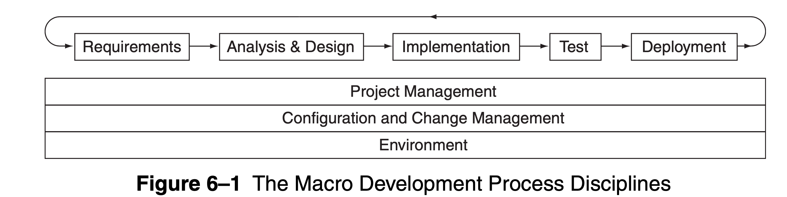
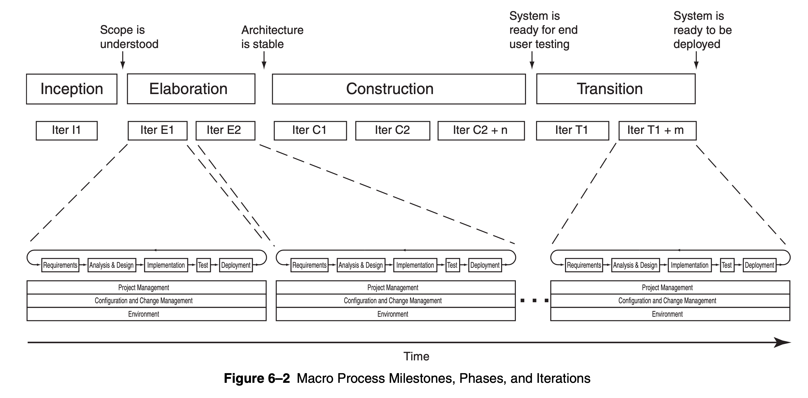

# ooad
- 问题
    - object-oriented decomposition
    - ooa,ood,oop之间的关系
        - 分析
            - 理解业务，抽象出业务概念，输出业务模型
        - 设计
            - 在业务模型的基础上加入技术关注点，输出架构，架构，模块
        - 编程
            - 重点使用编程语言，理解编程语言的特性，特别是oo方面
- 概念
    - 复杂性
        - 思路：从现有的系统中学习，包括人为系统，自然界复杂系统提特点
        - 软件复杂度
            - 软件复杂度有点任意，不想自然科学有爱因斯坦的那种上帝不投骰子的信念
        - 软件复杂在于创造工业级软件，那些原型，实验性的软件写完就可以扔了
            - 特点是时间长
            - 功能复杂
            - 参与人多
        - 主要四点
            - 问题领域本身复杂（要做什么没搞清楚）
                - 包括原始功能复杂
                - 非功能性需求：可用性，性能，成本，可靠性等等
                - 开发人员和业务人员之间沟通的gap。即使都是专家也不容易把导致上面这些需求沟通清楚，更别提有时候用户对需求只有模糊的概念。
                - 开发过程中需求经常改动，主要是因为软件开发过程会改变系统规则，因为开发出来以后用户能够更加明确自己的需求，知道自己要啥不要啥。但是，同时开发人员也能更好理解需求，然后发现系统的一些bug
            - 管理开发过程困难
                - 因为工作量已经很大了，需要团队协作才能完成
                - 团队协作主要困难在于：大家对设计达成一致，这里一致包括两个过程：一个是不同的意见折中到一个具体的意见，另一个是对达成的这个设计大家是真心认可的
            - 灵活性（为了适应新的场景容易修改），这不 **是好出么，怎么是难点了**
                - 不像建筑行业对统一的构建流程和原材料的工业化标准
                - 软件具有的这种灵活性导致开发容易造轮子，自己开发底层代码
                - 最终软件开发还是体力劳动密集型工作
            - 对离散系统行为特征话问题（解决 **这个问题是要减少系统状态以及影响因子** ）
                - 如果一个系统能被一个连续函数所描述，也就是说外部小得变化引起小的变动，不会有让人吃惊的变化
                - 离散系统一个小的外部变化就有可能引起系统大的变化，因为有好多好多不同的变量组合在一起
        - 所有复杂系统的五个特征
            - 层级结构（没有层级结构，也就无法分解，也就无法理解）
                - 复杂系统的架构不仅仅是组件的功能集合，包括这些组件之间的层级关系
                - 一个子系统的价值来自与其他子系统之间的关系，不是来自自身的功能
                - 也就是能被分成几乎独立的部分，但是还是有联系
            - 具有相对的原始组件
                - 系统中什么组件是原始的取决于系统观察者的视角，有时候一个人的原始组件可能是对另外一个人的原始组件的抽象
            - 关注点分离
                - 和分成有关系
                - 从分层角度看组件内部的之间的链接要比组件和其他外部组件之间的联链接要强
                - 这里的链接强度不同，可以给以不同的关注
                - 所以，通过关注点分离出不同部分以后可以独立研究每一部分
            - 通用模式
                - 每个系统都具有表达经济的特点
                - 怎么个经济法：
                    - 只有几种不同的子系统
                    - 通过组合，编排不同的子系统
                    - 复用子系统
            - 稳定的中间形式
                - 可用的复杂系统无一例外不是从一个简单的系统燕演化
                - 复杂系统不是一次性从头搭起的，是基于稳定可用的其他更简单的系统搭起来的
                - 但是通过迭代获得稳定可用的基础组件，不是一次就搞定的
                - 搭起的系统又可以作为其他更复杂系统的起点
        - **组织与没有组织的复杂性啥意思**
            - **复杂系统的简单形式？？？看下一章(organized)**
                - class hierarchy "is a" hierarchy
                - object hierarchy "part of" hierarchy
            - 人类有限的处理问题能力（disorganized）
                - 数据人类能同时理解的信息片段数量是5-9个
                - 天才是少数，需要代更加规范的方法解决复杂问题
        - 怎么解决越来越复杂的软件与人类有限的处理复杂问题的能力
            - 解耦
                - 算法解耦
                    - 自顶向下
                    - 每个模块是代表整个模块的其中一部分
                    - 强调具体事件的顺序，每步做什么
                    - 弱点：实践证明超过10w行代码的项目就会出现问题
                - 面向对象解耦
                    - 强调是agent，agent会触发一个行为，或者接受
                    - 更加推荐， **更加符复杂的特征**
            - 抽象
            - 分析和设计方法
                - 自顶向下的结构化设计，或者说是组合设计
                    - 把大问题分成一步一步的小问题，形成一个树状结构，每个子程序调用其他子程序完成任务
                - 面向数据设计
                - 面向对象设计
- 对象模型
    - 对象模型是基于之前的技术产生的
    - 软件工程的历史
        - 小程序到大程序
        - 高级语言进化
    - 对象模型的演化
        - 第一代语言
    - OOP
    - ood
    - ooa
- 对象模型元素，前面四个是核心
    - 抽象
        - 简化事物，降低认识难度
    - 封装
        - 抽象以后还有东西实现抽象的，把部分内容围起来，限制访问权限，至少不是和抽象的概念一样，封装
    - 模块化，modularity
        - 给系统划分成几个模块，每个模块包含内容相近的事物，也是为了方便管理
        - 封装在这里也是必须的
        - 模块本质也是对抽象的封装
    - 层次化，hierarchy
        - 抽象之间的排名或者顺序
        - is a的类层析图
        - has a的对象层次图
    - 类型
    - 并发
    - 持久化
- 类和对象
    - 对象（object，instance）
        - 定义
            - 一个实体，有状态，行为，标识
            - 状态（state）
                - 静态属性，动态属性值
                - 占用物理空间或者内存
                - 和行为的关系：行为的累计结果
            - 行为（behavior）
                - 定义：对象对外展示的活动，通过消息传递和状态改变表示一些动作或者反应
                - 操作或者消息（operation，message）
                    - 修改，modifier
                    - 查询，selector
                    - iterator
                    - constructor
                    - destructor
                - role responsibility
                    - role履行responsibility
                    - role由状态和行为定义
                    - 一个对象有很多不同的角色
                - 主动被动对象
                    - 主动调用别人的对象，不用别人来调用
                        - 这个也是相对的，os或者硬件最主动了，因此需要一个上下文
                    - 被动，是状态要改变必须是别人调用才行
            - 标识（identity）
                - 用于区别其他对象的属性
                - **需要区分对象本身和对象名称**
        - 对象之间的关系
            - links
                - a调用b，a给b发消息，a和b之间有link
                - 可见性 visibility
                    - a感知b，但是b不能对其他人可见
                - 同步 synchronization
                    - 顺序 sequential
                        - 线程不安全，只有一个active对象调用的时候没问题
                    - 主动观测 guard
                        - 提供线程安全机制，但是需要active 对象协调
                    - 并发 concurrent
                        - 线程安全
            - aggregation
                - 整体和部分关系，同时能够导航整体到部分
                - 是link的一种
                - 并不是物理包含关系，更多的是概念层面的
                    - 飞机有轮子，飞翼等等物理部分
                    - 股东有股票，股票是虚拟的没有实物
                - 用于分装部分比较好，松耦合用link
    - 类
        - 问题
            - **class liftcycle**
        - 关联目的
            - 共享：is a，特殊与一般
            - 语义联系：整体与部分
        - 类之间的关联
            - association
                - 只表明两个类有关系，比较粗糙的语义，没有指定关联方向
                - 早期分析与设计阶段
            - 继承
                - 表示一般与特殊关系
                - 单继承，多继承
                - 强调is a
            - aggregation
                - 整体与部分关系
- 分类，再看看
    - 在ooa，ood中需要发现和发明
    - 过程
        - 增量和迭代过程
        - 难点在于同样的对象有多种分类的方法
        - 两个重要概念
            - key abstraction：解决有哪些对象
                - 反应出问题领域的词汇
                - 发现于问题域或者发明于设计
            - mechanism：解决怎么交互
                - 关注不同类型对象之间合作活动的设计决策
    - 方法
        - 属性分类
            - 具备或者不具备某种属性
        - 概念分类
            - 是否适合某个概念（怎么算适合不适合）
            - 先描述，然后看是否合适
        - 原型分类
            - 和原型的相似程度
- 方法：上面都是原理
    - 标记
        - UML
            - 两种图
                - 结构：元素
                - 行为：元素之间的关系
            - 使用注意点：目的是描述清楚系统，静态和动态，元素与元素之间的关系，图本身不是目的
            - 模型
                - 概念模型（分析）
                    - 抽血业务概念，通过业务概念模拟业务需求，建立模型
                - 逻辑模型（设计）
                    - 使用业务模型，建立关键抽象以及这些关键抽象之间的关系
                - 物理模型（实现）
                    - 描述实现的软件和硬件组成
    - 过程
        - 面向对象系统首要原则
            - 强架构愿景
                - 概念是完整的
                - 合适的分层抽象，提供合适的、可控的接口
                - 每层做到接口和实现的分离
                - 简单，常规的行为通过常规的抽象和机制完成
            - 迭代和增量开发方法
                - 通过连续发布多个版本逐步完善功能
                - 好处
                    - 容忍需求的变化
                    - 没有声势浩大的集成
                    - 风险能够提早解决
                    - 为了应对竞争可以战术的修改产品功能
                    - 复用是简单的
                    - 及早发现和修复错误
                    - 更加有效雇佣员工
                    - 团队成员能够持续学习，每个迭代之后都能够复盘学习当前迭代的内容
                    - 精细化并改进开发过程
        - 两种开发方法
            - 计划驱动
            - 敏捷
        - 软件开发视角
            - 宏观
                - 内容：做什么 
                    - 角色、任务、工作产品
                - 时间：什么时候完成 
                    - 里程碑
                    - 阶段
                    - 迭代
                - 问题
                    - **架构怎么验证是否符合要求**
                        - 测试一些典型场景，设计关键组件的场景
                        - 存在风险的场景
                    - 什么是架构的接口和机制
                        - architectural interfaces and mechanisms
            - 微观