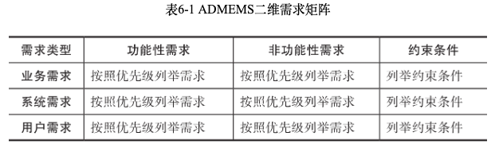
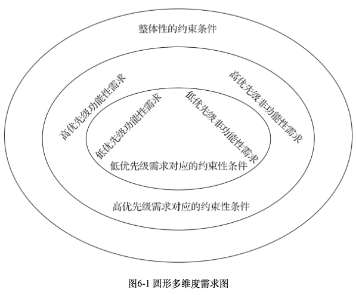
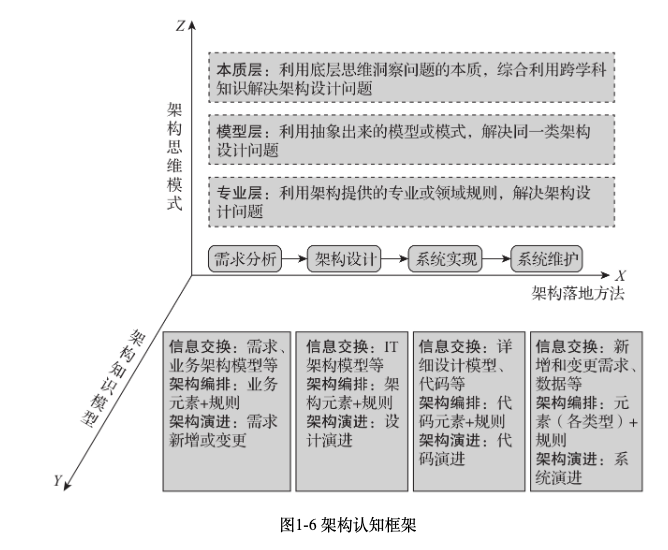

# 架构师启示录-知识模型、落地方法与思维模式
- 知识模型
    - 信息交换
    - > 获取信息以后，会生成不同的模型，是核心工具
        - 功能模型
        - > 干什么，为什么
        - 结构模型
        - > 是什么
        - 行为模型
        - > 怎么做
    - 架构编排
        - 元素
            - 类型
            - 规模
        - 规则
            - 分类
                - 空间
                - 具体架构规则
                - > 面向对象、过程
                - 时间
            - 系统模型
                - 功能模型
                    - 元素：过程
                    - 规则：业务流程
                - 结构模型
                - > 类图、包图
                - 行为模型
                - > 时序图
    - 架构演进
        - 敏捷
        - > 本质是『负反馈』，尽快知道当前进度和目标的差距 有负反馈以后，知道要做啥了，
        - devops
        - > 解决怎么做的问题减少研发、QA、运维的信息差，加速交付
        - 两者关系
        - > 敏捷是核心，devops是工具
        - 演进的内容
        - > 架构编排
- 落地方法
    - 1. 需求分析
    - > 定义清楚问题
        - 问题
        - > 来了以后怎么管理 怎么完成
        - 需求捕获
            - 明确业务目标
                - 三要素
                - > 举例来说，电商秒杀系统的业务目标可以描述如下：为了给客户带来卓越的购物体验，需要开发一个秒杀系统，在双11期间的零点至一点之间提供商品秒杀功能，预计在秒杀高峰期间，并发用户数约为每秒500万人。
                    - 明确给客户带来的价值
                    - 明确系统功能
                    - 需要数据支撑价值、功能
            - 识别系统类型
                - 用户交互系统
                - > 面向客户提供企业服务，并从外到内实现前端界面交互和面向用户的服务流程 ​关注： 1.用户体验 2.流程整合 3.渠道整合 4.客户唯一性
                - 业务处理系统
                - > 提供具体业务处理能力，并实现企业对外的专业服务能力 关注： 1.流程分析 2.业务建模 3.数据归集
                - 数据分析系统
                - > 提供决策支持能力 关注： 1.决策场景 2.报表类型 3.分析工具
                - 后台支持类系统
                - > OA办公、财务、人力等的系统 关注：工作流程
            - 分析需求组成
                - 业务需求
                - > 系统出资方要达到的业务目标、预期投资和工期要求等
                - 用户需求（外部需求）
                - > 用户使用的功能
                - 系统需求（内部需求）
                - > 为了实现用户需求需要实现的功能
                    - 功能性需求
                    - > 系统做什么 **和系统架构无关**
                    - 非功能性需求
                    - > 怎么更好的实现功能 **决定系统架构**
                        - 开发阶段
                        - > 易理解性、可重用性、可测试性、可扩展性、可维护性、可移植性
                        - 运行阶段
                        - > 高性能、安全性、高可用、易用性、可伸缩性、可操作性、可靠性、鲁棒性、可监控性、运营指标可获取性
                    - 约束条件
                    - > 功能需求和非功能需求的约束条件
                        - 业务环境因素
                        - > 客户/出资方的约束，如预算限制、上线时间要求、集成要求、业务限制、法律法规、专利限制等
                        - 使用环境因素
                        - > 用户的使用环境，年龄、国籍、性别
                        - 构建环境因素
                        - > 开发运维团队以及专业能力水平
                        - 技术环境因素
                        - > 编程语言、中间、OS、开发框架
            - 捕获利益攸关者需求
                - 系统使用方
                - > 系统的使用者
                - 系统支持方
                - > 出资者、系统开发&维护人员
                - 启发式问题
                    - 你希望系统提供什么功能
                    - 你希望在系统里面做什么
                    - 你做这个事情的原因是什么
                    - 完成任务后，你期望后面发生什么
                    - 如果提的需求是现阶段的，未来你希望系统提供什么功能
            - 划分需求优先级
                - 划分需求考虑因数
                    - 约束条件
                    - > 时间+成本
                    - 动态变化因素
                    - > 某些需求因为变化，可能变成不是必须的
                - 划分方法
                    - 系统提供给使用方的业务功能或者价值
                    - 利益攸关者
                    - > 比如监管需求优先级比较高
                    - 安全和稳定性
            - 区分变与不变的需求
                - 功能需求、非功能需求、约束条件
                - 确定变化的对象，根因，频率
                - 变化影响：范围、上下游，是一个网络链
                - 是否存在替代方案来避免或者应对变化
            - 输出需求说明书
                - 需求清单或者矩阵 
                - 圆形来表达多维度需求
                -  
        - 业务架构设计
            - 定义
                - 动作：根据企业战略，业务建模
                - 企业战略：根据当前的市场需求，做的规划准备==
                - 作用：作为应用架构、数据架构、技术架构的基础，是业务和技术之间的桥梁
                    - 应用架构以业务流程和规则为基础
                    - 数据架构以业务实体为基础
                    - 技术架构以应用架构、数据架构为基础
                - 输出
                    - 业务流程
                    - 业务实体
                    - 业务规则
            - 前置步骤
                - 确定业务范围和边界
                    - 用户是谁
                    - 哪些功能
                    - 上下游是什么
                - 可行性分析
                    - 当前的技术条件、时间、成本的约束下能否实现
                    - 评估时间、人力成本
            - 使用范围：企业战略调整比较多，比较大的情况
            - 核心关注点
                - 正确的问题，不是问题的答案（问题都没定好呢）
                    - 解决问题的范围
                    - 这些问题和企业战略有什么关系
                    - 解决这些问题能给用户带来什么价值
                    - 带来的价值在价值流中处于什么位置
                - 功能性需求
                - 关注企业的整体层面，而非部门或者业务线层面
                    - 定义价值流时应更多地考虑跨组织、跨部门的视角
                    - 在审视业务流程时要以端到端的视角进行
                    - 根据业务流程提取出来的业务能力也应首先从整个企业维度进行分析
            - 设计方法
                - 输入
                    - 企业战略
                    - 需求说明书
                    - 系统上下文
                - 方法
                    - 价值模型
                        - 价值流模型
                        - 价值链模型
                    - 服务蓝图
                    - > 价值模型+相关的实体
                    - 业务流程图
                    - 领域模型
                    - > 跨领域模型
    - 2. 架构设计
        - 应用架构
            - 核心是架构编排
                - 拆分（分工）
                - > 提供单位的效率
                    - 核心：明确应用的定位
                    - 两个拆分视角
                        - 业务关注点
                        - 技术关注点
                            - 生命周期
                            - 实时性
                            - 安全性
                            - 变更频率
                            - 高可用
                            - 弹性要求
                            - 。。。
                - 整合（协作）
                - > 完成业务功能，通过整合的成本反馈拆分是否合理
                    - 启发式整合
                        - 交互简单原则：如果复杂可能需要考虑整合应用
                        - 数据
                            - 分析
                            - 实时处理，数据越集中越好，不然会有一致性、可用性问题
                        - 接口
                            - 应用的接口很少被使用
                            - 一个应用的接口往往需要和其他接口一起使用
                - 误区
                    - 应用于单体
                    - 忽略拆分以后的成本
                        - 通信成本
                        - 整合成本
                    - 忽略非功能性需求在拆分时的重要性
            - 设计方案
                - 输入
                    - 价值模型、业务流程图、服务蓝图、领域模型
                    - 业务规则
                    - 非功能性需求
                - 步骤
                    - 业务流程场景化
                        - 例子：登入流程，可能有账号登入、微信登入、刷脸登入等3中场景
                    - 应用分层架构和应用交互
                        - 关键决策：架构风格，单体还是微服务还是其他
                    - 应用产品化
                        - 把一些开发工作配置化，变成产品
                        - 输出产品话规则
                - 注意点
                    - 架构元素：应用，不是功能
                    - 同一层的引用粒度是一样的，没有应用组或者功能模块
                    - 需要把外部系统给画出来
        - 数据架构
            - 定义
                - 结构视角
                    - 描述组织内部、外部资源的分类，关系，结构
                    - 包括：资源实体、实体属性、关联关系以及处理逻辑
                - 功能视角
                    - 聚集
                    - 脱敏
                    - 元数据
                    - 生命周期
                    - 。。。
            - 核心关注点
                - 流转或者交换产生价值，所以重点是数据流转的编排
                    - 归属于哪个应用
                    - 数据如何流转
                    - 数据怎么归集
                - 数据的聚合效应
                    - 指导应用拆分
                    - 大数据产生更好的效益
                - 目标：安全、准确、快速获取数据
            - 误区
                - 数据架构不仅仅服务与业务架构，间接实现业务价值，更可以驱动业务发展，提供洞见，可以提前规划
                - 数据架构来源于应用架构
                    - 数据架构在于归集数据发挥更大的价值
                    - 应用架构在于分工提高效率
            - 设计方法
                - 确定数据归属
                    - 输入：业务流程中的实体模型
                    - 输出
                        - ER模型
                        - 负责数据的部门或者角色
                            - 管理数据生命周期
                        - 主应用
                - 确定数据分布视图
                    - 副本
                    - 主应用不一定有所有维度的数据
                    - 以应用架构为基础
                - 确定数据流转视图
                    - 以应用架构为基础
                    - 输出：数据在各个应用之间的流转
                        - 传输方式
                        - 传输内容
                        - 实时性
                        - 安全性
                - 确定数据的归集
                    - 以应用架构为基础
                    - 输出（数仓）
                        - 指标数据
                        - 聚合逻辑
                        - 明细逻辑
        - 技术架构
            - 定义
                - 结构
                - > 描述应用系统、数据和基础设施之间的关系 基础设施包括：硬件、软件、通信、网络 关系：基础设施怎么支撑应用系统&数据
                - 功能
                    - 理论
                        - 分布式
                        - 算法
                        - 数据库理论
                        - 架构模式
                    - 落地实践
                        - 系统
                            - 接入层
                            - 业务层
                            - 数据层
                        - 工程
                            - 框架
                            - 版本管理
                            - devops
                            - 中间件
                            - 测试
                            - 运维
                            - 。。。
                    - 性能优化
            - 核心关注点
            - > 和当前的业务发展相匹配，不多也不少
                - 最合适的技术
                - 哪些需要自研&购买&使用开源模型
                - 哪些需要提前调研&自主掌控&升级
            - 误区
                - 使用最新的
                - 实现很多功能，没用到
                - 技术找场景
                - 过分依赖通用方案
            - 设计方法
                - 技术选型
                    - 需求->场景->目标->架构
                    - 启发式问题
                        - 不实现会怎么样
                        - 有没有替代方案
                    - 画出之前的架构决策，对比
                - 绘制技术栈
                    - 基于分层的应用架构
                    - 每层画出落地的技术栈
                    - 考察各层之间的技术栈是否合理
                - 绘制部署架构图
        - 整体设计
            - 检查各个架构是否满足业务需求，实现业务价值
            - 能力与目标对齐
            - > 能力=功能需求+非功能需求+约束条件
            - 平衡
            - > 这些也叫平衡吗？
                - 子系统之间能力需要匹配
                - > 高并发：链路上面的子系统都需要支持高并发
                - 适应业务需求变化
                - 使用业务量级变化
            - 短期利益与长期利益
                - 任何决策出发点，不错的视角
            - 架构决策可回溯性
                - 稳定性和可维护性：后面修改的时候有背景，不容易改错
                - 团队内部架构知识共享&共识
                - 拥有更多当前系统的上下文，可以简化设计
            - 简化设计：只进行最低限度的设计
            - > 最低限度是指当前能够掌握的最大程度的信息 ​《演进式架构》
        - DDD vs TOGAF
    - 3. 系统实现
        - 1. 工程和包设计
        - 2. API设计
        - 3. 公共组件设计
        - 4. 数据设计
        - 5. 中间件设计
        - 6. 重要类设计
    - 4. 系统维护
        - 1. 问题定位与分析
        - 2. 数据收集与指标分析
        - 3. 需求增长和系统扩张
- 思维模式
    - 专业
    - > 各种技术
    - 模型
    - > 解决通用的问题，类比设计模式
    - 本质
        - 问题：还不知道啥意思
- 整体结构 
- 问题
    - 架构演进细节
        - 代码
        - 模型