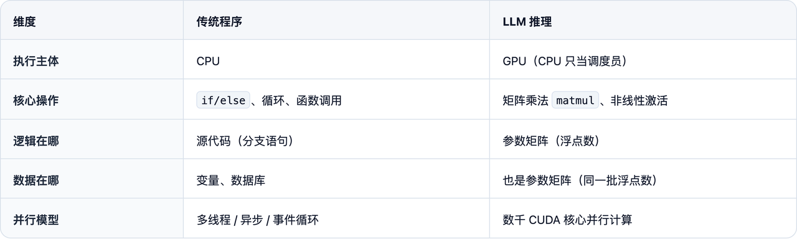

解析耗时: 1.85s
---

Chrome 团队有一篇著名的 [**Life of a Pixel**](https://docs.google.com/presentation/d/1boPxbgNrTU0ddsc144rcXayGA_WF53k96imRH8Mp34Y)，从一个 `<div>` 出发到屏幕像素，追踪它在浏览器渲染管线中的旅程：DOM → Style → Layout → Paint → Raster → Composite，用每个阶段串起引擎全貌。

我们做同样的事，但追踪的不是像素，是 **token**。

Token 是 LLM 的最小处理单元：模型不看字符，不看单词，只看 token。`"The"` 是一个 token，`" capital"` 是一个 token，`"unbelievable"` 会被切成 `"un"` + `"believ"` + `"able"` 三个 token。Token 之于 LLM 管线，就像像素之于渲染管线。

我们追踪的 Hello World 是：`"The capital of France is"`

你一眼就知道答案：巴黎。读完 Ch6，你会看到 `" Paris"` 以 74.67% 的概率断崖领先，模型仅凭矩阵乘法与非线性变换，逐层把这个答案算了出来。

这篇文章沿着这条管线，带你走完一个 token 从输入到输出的每一步。内容对非算法同学友好。

> 全文用 **GPT-2 Small **做 trace——不是因为它强，而是因为它透明：架构与现代 LLM（GPT-4、LLaMA）完全同构，但参数少到可以在笔记本上秒级复现、逐层打印中间状态。把它当成管线的最小可运行示例：理解了 12 层，扩展到 32 层只是数字放大。
> 复现环境：MacBook M4 Max / Python 3.12 / PyTorch 2.5.1 / Transformers 4.48.3 / tiktoken 0.8.0。

---

# 0x0 Before the Trace

打开你写过的一个程序。逻辑在 `if/else` 里，数据在变量里，两者界限分明。判断用户是否登录？一个布尔值加一个条件分支。查找首都？一个 HashMap，key 是国家，value 是城市。

在大语言模型里，**两者是同一个东西**。

## 0x00 一切皆浮点

打开 GPT-2 Small 的权重文件：1.24 亿个浮点数。没有 `if/else`，没有 `switch`，没有一行代码说"如果问法国首都就回答巴黎"。翻遍每一个字节，找不到任何显式的条件判断。

那么，当你输入 `"The capital of France is"`，它怎么"知道"下一个词是 `" Paris"`？

答案反直觉：它不"知道"。1.24 亿个浮点数排成矩阵，输入 token 变成向量，流过 12 层矩阵乘法和非线性变换。终点恰好落在词表空间中 `" Paris"` 的方向上，概率 74.67%，断崖式领先。

没有任何一个参数单独"负责"这个答案，答案是数值路径的终点。

整条管线可以看作一个跑在 GPU 上的程序：权重加载后常驻显存，只读不改，类似进程里的 .rodata 段；每次推理就是一次函数调用，输入是 token 序列，输出是下一个 token 的概率分布。

它和你写的程序有什么区别？


> 推理系统的其余部分：采样、终止判断、KV Cache 管理，仍然是传统的控制流代码。

## 0x01 管线概览

深入每一步之前，先看一眼完整管线。关注点不只是模型有哪些组件，更是数据在每一步的变换。


24 字节进去，膨胀到 15 KB（FP32），穿过 12 层矩阵乘法，坍缩回 1 个整数。

下面是整条管线的伪代码。不必现在逐行读，它是全文的"可执行目录"，每行注释标注了对应章节。先扫一遍建立全局印象，后面每读完一章回来看对应的几行，会越来越清晰：

```python
def generate_next_token(text: str, model, tokenizer) -> str:
    # ── Phase 0: Tokenize (CPU) ──  ▶ 「0x1 Tokenization：从文本到 Token ID」
    token_ids = tokenizer.encode(text)          # "The capital..." → [464, 3139, 286, 4881, 318]（5 个 Token ID 值）

    # ── Phase 1: Embed (GPU, gather) ──  ▶ 「0x2 Embedding：Token ID 膨胀为向量」
    x = model.wte[token_ids]                    # shape [1,5] → [1,5,768]  Token Embedding
    x = x + model.wpe[range(len(token_ids))]    # + 位置编码 → shape [1,5,768]

    # ── Phase 2: 12 层 Transformer (GPU) ──  ▶ 「0x5 Layers: 12 层到 " Paris"」
    for layer in model.layers:                  # 12 层逐层循环，每次结构相同
        # --- Self-Attention ---  ▶ 「0x3 Self-Attention：让向量互相看见」
        residual = x
        x = layer_norm(x)
        Q, K, V = x @ Wq, x @ Wk, x @ Wv      # 三个投影 shape [1,5,768] → [1,5,768]
        # ↑ 实际实现中 Q/K/V reshape 为 [1,12,5,64]（12 头，每头 64 维；12×64=768）
        scores = (Q @ K.T) / sqrt(d_k)          # d_k=64（每头维度），scores: shape [1,5,5]
        scores = apply_causal_mask(scores)       # 未来位置设为 -∞
        weights = softmax(scores)               # 归一化为概率
        attn_out = weights @ V                  # 加权求和 shape [1,5,768]
        attn_out = attn_out @ Wo                # 输出投影 shape [1,5,768] → [1,5,768]
        x = residual + attn_out                 # 残差连接

        # --- FFN ---  ▶ 「0x4 FFN：用上下文检索知识」
        residual = x
        x = layer_norm(x)
        hidden = gelu(x @ W1)                   # 升维 shape [1,5,768] → [1,5,3072]（3072 = 4×768）
        ffn_out = hidden @ W2                   # 降维 shape [1,5,3072] → [1,5,768]
        x = residual + ffn_out                  # 残差连接

    # ── Phase 3: LM Head (GPU) ──  ▶ 「0x6 LM Head：从向量到概率」
    x = layer_norm(x)
    logits = x[0, -1] @ W_lm_head              # 只取最后位置 [768] → [50257]

    # ── Phase 4: 采样 (CPU/GPU) ──
    probs = softmax(logits)
    next_token_id = sample(probs)               # → 6342 = " Paris"
    return tokenizer.decode(next_token_id)

# 外层会反复调用这个函数，并把新 token 追加回输入  ▶ 「0x7 自回归：LLM 的斐波那契」  
```

> **记号约定：**后文中方括号 `[...]` 有两种含义：
> 
> - **值（元素内容）**：`[464, 3139, 286, 4881, 318]` — 数组里装的东西，这里是 5 个具体的 Token ID。特征：数字大、不规律。
> - **形状（shape）**：`float[1, 5, 768]` — 多维数组的**各维大小**。特征：数字小、有结构。三个维度含义：`[batch_size, seq_len, hidden_dim]`，即 batch_size=1（单条请求）、seq_len=5（5 个 token）、hidden_dim=768（每个 token 的向量维度）。
>   全文 batch_size 始终为 1。遇到歧义处会加标注。

管线就位，把 `"The capital of France is"` 喂进去，看看会发生什么。

---

# 0x1 Tokenization：从文本到 Token ID


代码的第一行是 `tokenizer.encode(text)`，管线从这里开始。

GPU 的计算单元只做一件事：数值运算。矩阵乘法、向量加法、激活函数，全是数字。UTF-8 字符串？它看不懂。

所以第一步是把字符串变成整数序列，即 **Tokenization**（分词）：把连续文本切分为模型词表中的离散单元，就像编译器的 lexer 把源代码切成 token 流。

最朴素的做法是按字符编码，每个字符一个 ID，但一个词动辄拆成 5–10 个 token，序列太长。按单词编码呢？英文有几十万个词，词表太大。

GPT-2 用的是 **Byte Pair Encoding（BPE）**，一种子词分词算法，在字符级和单词级之间取平衡。训练时反复合并高频字节对来构建词表（原理类似 gzip）。训练完成后词表冻结，本质上就是一个静态 HashMap：`token_string → token_id`，50257 条记录，只读不改。推理时纯查表。

> **50257 这个数字从哪来？** 它是 GPT-2 BPE 词表的大小，训练时由合并轮数决定，之后固定不变。后文会反复遇到这个数字：Embedding 矩阵有 50257 行（每个 token 一行），LM Head 输出 50257 个 logit（每个候选词一个分数），一头一尾，同一个数字。

用 OpenAI 的 `tiktoken` 跑一遍：
| `#!/usr/bin/env python3 import tiktoken  prompt = "The capital of France is" enc = tiktoken.encoding_for_model("gpt2") tokens = enc.encode(prompt)  print(tokens)  # [464, 3139, 286, 4881, 318] for t in tokens:     print(f"{t:>6d}  ->  {repr(enc.decode([t]))}") ` |  |
| --- | --- |

5 个 token，5 个整数。注意 `" capital"` 的前导空格：BPE 把空格编码为 token 的一部分，让模型能区分词首与词中。

> [!NOTE]
> **小结**：Tokenization 把 GPU 看不懂的字符串变成它能处理的整数序列。BPE 词表是冻结的 HashMap，推理时纯查表。
> 5 个整数拿到了，但整数能直接做矩阵乘法吗？

---

# 0x2 Embedding：Token ID 膨胀为向量


` France` 的 Token ID 是 4881，` capital` 是 3139，差了 1742，这能告诉你任何语义关系吗？

不能，这个差值是词表构建的偶然产物，跟语义没有任何关系。要做数值运算（矩阵乘法、点积、加法），每个 token 必须从标量编号变成高维向量。这就是 **Embedding**（词嵌入），把离散 Token ID 映射到连续向量空间中的一个点，类似于把数据库主键展开成一行特征向量。

## 0x20 编号不可算，向量可以

用颜色打个比方，Pantone 色号 `186 C`（红）和 `293 C`（蓝）。`186 - 293 = -107`，这个数字能告诉你红和蓝有什么关系吗？什么都说不了。色号只是查询代号，差值没有语义。Token ID 也一样，`4881 - 3139` 毫无意义。

但 RGB 不同：`(255, 0, 0)` 是红，`(0, 0, 255)` 是蓝。现在你可以算距离、做混色、判断相似度，因为每个分量都有意义（红绿蓝三个通道的亮度），它们构成一个可计算的向量空间。


Token ID → Embedding 做的就是这件事：把编号变成向量。只不过不是 3 维 RGB，而是 768 维（RGB 各维度有明确含义，Embedding 的 768 维没有人工赋予的含义，它们是训练过程中自动涌现的）。

GPT-2 Small 有一个 Embedding 矩阵 `wte`，shape 为 `[50257, 768]`，词表中每个 token 一行（50257 行，Ch1 的词表大小），每行 768 个浮点数。

> **768 这个数字是什么？** 它是 GPT-2 Small 的"隐藏维度"（hidden_dim），模型配置里写死的超参数，决定了每个 token 用多少维的向量来表示。768 是全文出现频率最高的数字：从 Embedding 查表到最后 LM Head 投影，所有中间状态的向量宽度都是 768。你可以把它理解为这条管线里的"总线宽度"，贯穿始终。

把 Token ID 4881 送进去，取出第 4881 行，得到一个 768 维向量。操作本身极其简单：查表，没有计算，没有学习，就是用整数做索引取出一行。在 GPU 上，这是一次纯内存操作，`nn.Embedding` 在推理时等价于一次 `gather`。

但这张矩阵不是随机的，它是训练过程收敛后的结果。第 4881 行（`" France"`）和第 6342 行（`" Paris"`）在 768 维空间中的几何关系，恰好编码了"法国-首都-巴黎"这一知识。回到我们的追踪对象：5 个 Token ID 变成 5 个 768 维向量后，`" France"` 和 `" capital"` 不再是差了 1742 的两个整数，它们之间的方向和距离携带着语义信息。

## 0x21 知识是向量空间中的方向

RGB 的三个维度有明确的物理含义。相比之下，Embedding 的 768 维没有任何一维叫"国籍"或"词性"，单个维度没有人类可读的含义，但**方向**有。

最经典的例子：

$\vec{king} - \vec{man} + \vec{woman} \approx \vec{queen}
$

背后的规律：语义关系在向量空间中表现为方向。"男性→女性"是一个方向，"国家→首都"又是一个方向。训练过程不会"告诉"模型"把性别编码成某个方向"，但统计压力迫使它这么做：当模型必须从上下文预测下一个词时，把同类关系安排到平行的向量位移上是最高效的信息压缩方式。

研究者称之为线性表征假说：概念在向量空间中对应一个方向，不是一个"存储位置"。存在一个"法国方向"、一个"首都方向"，它们之间有可计算的几何关系。

> 768 维够编码成千上万个概念吗？够的。高维空间中"几乎正交"的方向远超 768 个，多个概念通过稀疏叠加（Superposition）共享同一组维度，只要它们不经常同时激活。代价是单个维度不再对应单一含义，这正是 Embedding 不像 RGB 那样"每维语义透明"的原因。

### 768 维空间里的加减法

听起来很抽象，用 GPT-2 的真实权重验证一下

```python
#!/usr/bin/env python3
import torch
from transformers import GPT2LMHeadModel, GPT2Tokenizer

model = GPT2LMHeadModel.from_pretrained("openai-community/gpt2", attn_implementation="eager")
tokenizer = GPT2Tokenizer.from_pretrained("openai-community/gpt2")
E = model.transformer.wte.weight.detach()  # [50257, 768]

def token_vec(word: str) -> torch.Tensor:
    ids = tokenizer.encode(word)
    assert len(ids) == 1, f"{word!r} -> multiple tokens: {ids}"
    return E[ids[0]]

def nearest(vec: torch.Tensor, top_k: int = 5):
    sims = torch.cosine_similarity(vec.unsqueeze(0), E, dim=1)
    vals, idxs = sims.topk(top_k)
    return [(tokenizer.decode([int(i)]), float(v)) for i, v in zip(idxs, vals)]

# 实验 1: king - man + woman
result1 = token_vec(" king") - token_vec(" man") + token_vec(" woman")
print("king - man + woman ~=", nearest(result1, 5))

# 实验 2: France + (Tokyo - Japan)
result2 = token_vec(" France") + (token_vec(" Tokyo") - token_vec(" Japan"))
print("France + (Tokyo - Japan) ~=", nearest(result2, 5))
```


实验 1：减掉"男性方向"、加上"女性方向"，`queen` 出现在前几名。实验 2：把"日本→东京"的位移方向加到"法国"上，`Paris` 也在前几名。这些不是 Embedding 层刻意设计的功能，而是**训练过程**中自然涌现的几何结构，768 个维度里，加减法就是语义运算。

## 0x22 位置编码：给向量加上门牌号

还有一个问题没解决：`" capital of France"` 和 `" France of capital"` 用了完全相同的 token，查出完全相同的向量，但语义天差地别。Embedding 查表是逐 token 独立的：`" France"` 在位置 3 和位置 0 查出来的向量完全一样。模型怎么知道谁在前谁在后？

GPT-2 的解决方案直截了当：再加一个矩阵——**位置编码**（Positional Encoding）是向 token 向量注入序列位置信息的机制，就像给数组元素同时记住值和下标。

GPT-2 的位置编码矩阵 `wpe` shape 为 `[1024, 768]`，1024 是 GPT-2 的最大上下文窗口（位置编码表只有 1024 行，输入超过 1024 个 token 就没有对应的位置向量，相当于数组越界），每个位置一个 768 维向量。Token Embedding 和 Position Embedding 逐元素相加：最终向量 = `token_embedding[token_id] + position_embedding[position]`

位置 0 的 `" The"` 和位置 3 的 `" The"` 虽然 Token ID 相同，但加上不同的位置向量后，它们在 768 维空间中的坐标不同，后续所有计算都能区分它们。

> GPT-2 用绝对位置编码；现代模型用 RoPE（旋转位置编码），通过旋转矩阵将位置信息编码到 Attention 的点积中，天然支持长度外推。机制不同但目标一致：让模型区分同一个 token 在不同位置的出现。 

> [!NOTE]
> **小结**：Embedding 把 5 个 Token ID 膨胀为 shape `[1, 5, 768]` 的浮点张量，数据量膨胀 768 倍（FP32）。从此语义关系变成几何关系，加减法就是语义运算。
> 问题是，这 5 个向量现在各管各的。`" capital"` 不知道后面跟着 `" France"`，`" is"` 不知道前面有 `" capital"`。想预测下一个词，它们得互相看见。

---

# 0x3 Self-Attention：让向量互相看见


从这里开始，token 进入 Transformer 的核心结构：**Transformer Block**（通常简称"层"）。GPT-2 Small 有 12 个 Block，编号 Layer 0 到 Layer 11，依次串联。每个 Block 内部分两步：**① Self-Attention**（跨位置信息路由）→ **② FFN**（单位置知识注入）。我们当前在 Layer 0，从步骤 ① 开始。

为什么"互相看见"很重要？`" capital"` 的向量里同时挤着"首都 / 大写字母 / 资本 / 极刑"四种含义，仅凭自身无法消歧，必须看到 `" France"` 才知道该取"首都"。`" is"` 必须看到整句话才能预测下一个词。

**Self-Attention**（自注意力）就是做这件事的机制：每个位置发出一个查询，检索所有前序位置的相关信息，按相关性加权汇总，一个可学习的内部搜索引擎。

## 0x30 Q / K / V：一个向量的三种身份

搜索引擎有三个要素：查询词、索引、文档内容。Self-Attention 也一样，但每个位置同时扮演搜索者和被搜索者，因此需要三套独立的表征。以 `" is"`（位置 4）为例，它收集信息的过程可以拆成三个问题：

1. **我需要什么信息？**（Query）——`" is"` 的需求：我在 `"The ___ of ___ is"` 句式中，需要找到"主语是什么"和"在问什么属性"
2. **每个 token 能提供什么线索？**（Key）——`" France"` 作为被搜索者的身份标签：我是一个国家名
3. **每个 token 的实际内容是什么？**（Value）——`" France"` 作为信息载体：法国这个概念的全部语义信息

注意：Key 和 Value 不是同一个东西。**Key** 是搜索结果的标题摘要，标明"我能回答什么问题"；**Value **是点进去之后的完整页面内容。搜索靠标题匹配，但你真正要的是页面里的信息。

为什么需要三个独立的投影矩阵？因为同一个向量要同时扮演三种角色。`" France"` 也是查询者，它同样要从别的 token 收集信息；但它的 Query（"我需要什么"）和它的 Key（"我能提供什么"）完全是两件事。共用同一组参数会让三种信号互相干扰，所以 $W_Q$、$W_K$、$W_V
$ 各自把输入投影到不同的子空间。

投影到多少维？GPT-2 Small 有 12 个并行的 Attention Head（下一节展开），768 维被均分给 12 个 Head，每个 Head 分到 64 维（`768 ÷ 12 = 64`，不是独立超参数，而是均分的结果）。每个 Head 的投影矩阵为 `[768, 64]`，把 768 维输入投影到该 Head 自己的 64 维工作空间：

```plaintext
Q = x · W_Q    # [768] → [64]  "我需要什么"（在这个 Head 的 64 维子空间中）
K = x · W_K    # [768] → [64]  "我能提供什么"
V = x · W_V    # [768] → [64]  "我的实际信息"
```

12 个 Head 各自输出 64 维结果，拼接后恰好回到 768 维（`12 × 64 = 768`），维度先拆后拼，总量守恒。

> 上面说 `" is"` 的"需求"是找主语、找属性**，那这个需求哪来的？**不是人为规定的，`" is"` 的向量本身并不知道该去匹配什么；是 $W_Q$ 在训练中被反复调整，学会了把 `" is"` 投影到 64 维空间里的某个方向，恰好让它和携带主语 / 属性信息的 Key 点积最大、loss 最低。"找主语" "找属性"并不是模型里的显式指令，而是我们对训练后形成方向的一种事后语义解读。

## 0x31 Attention Score：从点积到权重

Q、K、V 就绪，下一步是打分：`" is"` 的 Query 要和每个前序 token 的 Key 做**点积**，算出"该从谁那里拿多少信息"。

整个过程：**Q·K 点积打分 → Mask 遮掉未来 → softmax 归一化 → 加权求和 V**。逐步展开。

Ch2 说过语义关系是向量空间中的方向。**点积（dot product）** 度量的就是两个向量方向的一致程度，逐维相乘再求和。方向越一致，点积越大；正交则趋近零。Ch2 的 `king − man + woman ≈ queen` 用的是向量加减法，这里 Q·K 打分用的是点积，同一个空间，不同的几何运算。

1. **点积打分与缩放：**每对位置 $(i, j)$ 的相关性分数：

$\text{score}_{ij} = \frac{Q_i \cdot K_j^T}{\sqrt{d_k}}
$

除以 $\sqrt{d_k}$ （$d_k = 64

$，即每个 Head 的维度）是为了防止点积过大导致 softmax 饱和，这就是"**Scaled** Dot-Product Attention"名字的由来。

1. **Causal Mask（因果遮罩）** ：自回归生成中，后续 token 尚未产生，不能引用——位置 $i$ 只能看到位置 $\leq i$ 的 token。实现方式：将上三角的分数设为 $-\infty
   $，softmax 后自然变成 0：


`" is"`（位置 4）能看到全部 5 个 token，`"The"`（位置 0）只能看到自己。重要推论：**只有最后一个位置看到了完整上下文**，这就是为什么最终预测只取最后一个位置的输出（Ch6 会回到这一点）。

1. **softmax → 加权求和：** Mask 之后，softmax 将分数归一化为概率分布——这就是 **Attention 权重**。权重越高，从该位置收集的信息越多。最终，按权重对所有位置的 Value 加权求和，得到这个位置的 Attention 输出。

整个 Attention 可以理解为一个**可学习的信息路由网络**：投影矩阵是路由表，点积算出匹配分数，softmax 归一化为权重，Value 加权求和完成信息搬运。用 SQL 类比（仅直觉对比）：`SELECT weighted_avg(V) FROM all_previous_tokens WHERE dot(my_Q, their_K) IS HIGH`

> **为什么点积能度量"语义相关性"？** 它本身不能，两个随机向量的点积是噪声。让点积有意义的是 $W_Q$ 和 $W_K$ 这两个投影矩阵：训练过程迫使它们学会把语义相关的 Q 和 K 投影到相似方向上，点积自然就高。这不是数学天然做到的，是训练出来的能力。

## 0x32 跑一遍：`" is"` 到底在看谁？

原理讲完了，拿 GPT-2 的真实权重跑一遍。

我们取 GPT-2 Layer 0 的 **Head 6**，计算 `" is"`（位置 4）的 Query 与每个 token 的 Key 的点积，经缩放和 softmax，看权重落在谁身上。为什么选 Head 6？12 个 Head 中它的语义路由模式最鲜明，下一节打印全部 12 个 Head 就能看到对比。

**预期结果：** `" France"` 和 `" capital"` 拿走约 70% 的 Attention 权重，功能词 `" of"` 和 `" is"` 自身加起来约 8%。

```python
import math, torch, torch.nn.functional as F
from transformers import GPT2LMHeadModel, GPT2Tokenizer

model = GPT2LMHeadModel.from_pretrained("openai-community/gpt2",
                                         attn_implementation="eager")
tokenizer = GPT2Tokenizer.from_pretrained("openai-community/gpt2")
inputs = tokenizer("The capital of France is", return_tensors="pt")
tokens = ["The", " capital", " of", " France", " is"]

layer0 = model.transformer.h[0]
with torch.no_grad():
    x = model.transformer.wte(inputs["input_ids"]) \
        + model.transformer.wpe(torch.arange(5).unsqueeze(0))
    x = layer0.ln_1(x)
    qkv = layer0.attn.c_attn(x)                    # [1, 5, 2304]（= 768×3，Q/K/V 三个投影拼在一起）
    q, k, _ = qkv.split(768, dim=-1)
    q = q.view(1, 5, 12, 64).transpose(1, 2)       # [1, 12, 5, 64]
    k = k.view(1, 5, 12, 64).transpose(1, 2)

head, pos = 6, 4          # Head 6, " is" 的位置
q_is = q[0, head, pos]    # [64]

scores = [torch.dot(q_is, k[0, head, j]).item() for j in range(5)]
scaled = [s / math.sqrt(64) for s in scores]
weights = F.softmax(torch.tensor(scaled), dim=0)

for tok, s in zip(tokens, scores):
    print(f"  Q_is · K_{tok:<8} = {s:>7.2f}")
print(f"\n  Scaled (÷√64):  {[f'{s:.3f}' for s in scaled]}")
print(f"  After softmax:  {[f'{w:.4f}' for w in weights.tolist()]}")
```

运行输出（GPT-2）：

```plaintext
  Q_is · K_The      =   -9.11
  Q_is · K_ capital =   -5.34
  Q_is · K_ of      =  -24.02
  Q_is · K_ France  =   -5.20       ← 最高分
  Q_is · K_ is      =  -20.90

  Scaled (÷√64):  ['-1.139', '-0.668', '-3.002', '-0.650', '-2.612']
  After softmax:  ['0.2167', '0.3470', '0.0336', '0.3531', '0.0497']
                    The      capital    of       France     is
```

全是负数，完全正常**。** softmax 只看**相对差距**，不在乎绝对值正负。`" France"` 的 −5.20 和 `" capital"` 的 −5.34 最接近零，远领先于 `" of"` 的 −24.02。缩放后经 softmax 归一化：`" France"` **35%**，`" capital"` **35%**，`"The"` **22%**，内容词并列第一，功能词加起来约 8%。

权重确定了每个位置的信息配比。Head 6 的最终输出 = 各位置 Value 向量的加权混合：

$\text{output}_{4}^{(\text{head 6})} = 0.22 \cdot V_{\text{The}} + 0.35 \cdot V_{\text{capital}} + 0.03 \cdot V_{\text{of}} + 0.35 \cdot V_{\text{France}} + 0.05 \cdot V_{\text{is}}
$

Head 6 把权重集中在 `" France"` 和 `" capital"` 上，路由模式明显偏语义。但这只是 12 个 Head 中的一个。

## 0x33 Multi-Head：12 双眼睛同时看

> **12 层 vs 12 头，别搞混。**  GPT-2 Small 有 **12 层**（Transformer Block 的堆叠次数，决定模型深度）和 **12 头**（同一层内并行的注意力子空间数）。两者恰好相等只是该模型的配置巧合，没有必须相等的理论要求。

一个 Head 只能学一种路由模式。GPT-2 Small 用 12 个 Attention Head 并行运行，即 **Multi-Head Attention**（多头注意力），每个 Head 用独立的 $W_Q$、$W_K$、$W_V
$（均为 `[768, 64]`）学习不同的模式。12 双眼睛同时盯着同一句话，各自在自己的 64 维子空间中捕捉不同信号。

打印 Layer 0 全部 12 个 Head 中，`" is"` 对各 token 的 Attention 权重：

```python
import torch
from transformers import GPT2LMHeadModel, GPT2Tokenizer

model = GPT2LMHeadModel.from_pretrained("openai-community/gpt2",
                                         attn_implementation="eager")
tokenizer = GPT2Tokenizer.from_pretrained("openai-community/gpt2")
inputs = tokenizer("The capital of France is", return_tensors="pt")
with torch.no_grad():
    outputs = model(**inputs, output_attentions=True)

attn = outputs.attentions[0][0]  # Layer 0, [12, 5, 5]
tokens = ["The", " capital", " of", " France", " is"]

print(f"{'Head':>6}", end="")
for t in tokens:
    print(f"{t:>10}", end="")
print()
for h in range(12):
    w = attn[h, 4, :]   # " is" 是位置 4
    print(f"{h:>6}", end="")
    for v in w:
        print(f"{v.item():>10.4f}", end="")
    print()
```

运行输出（GPT-2）：

```plaintext
  Head       The   capital        of    France        is
     0    0.6099    0.1519    0.0626    0.0945    0.0812  ← 首 token 偏好型
     1    0.0032    0.0022    0.0153    0.0011    0.9782  ← 自注意
     2    0.4694    0.0714    0.2085    0.0701    0.1806  ← 首 token 偏好型
     3    0.1055    0.0117    0.0675    0.0171    0.7982  ← 自注意
     4    0.2716    0.1780    0.1368    0.1392    0.2744  ← 均匀分散
     5    0.0624    0.0093    0.0082    0.0011    0.9190  ← 自注意
     6    0.2167    0.3470    0.0336    0.3531    0.0497  ← 内容路由
     7    0.2370    0.1145    0.1597    0.1559    0.3330
     8    0.2367    0.0409    0.2130    0.0368    0.4727
     9    0.4227    0.1113    0.2152    0.0861    0.1647  ← 首 token 偏好型
    10    0.4005    0.0957    0.1971    0.0375    0.2692  ← 首 token 偏好型
    11    0.4685    0.1190    0.1010    0.1225    0.1889  ← 首 token 偏好型
```

扫一眼右侧标注的模式类型，12 个 Head 清晰地分成几种**路由模式**：

- **自注意力型**（Head 1 / 3 / 5）：80–98% 权重给了 `" is"` 自身，保留本位置原始信号，不从别处搬运。
- **首 token 偏好型**（Head 0 / 2 / 9 / 10 / 11）：40–61% 权重给了 `"The"`，Layer 0 中首 token 常充当"默认锚点"（后续层可能改写这一偏好）。
- **内容路由型**（Head 6）：`" France"` 35% + `" capital"` 35%，上一节展开的那个 Head，唯一明显按语义打分的。
- **分散型**（Head 4 / 7）：权重在各 token 间相对均匀，没有突出的赢家。

Layer 0 多数 Head 仍在做位置级粗调，看自己或看句首，只有少数开始做语义路由。也正常：输入还是静态 Embedding，没有足够上下文支撑精细的语义匹配。更深层的 Head 会在前序各层积累的上下文基础上，做更精确的路由。

> 注意：不要过度解读单个 Head 的模式。实际中 Head 的行为高度重叠且随输入变化，没有固定的"职责名"。但 Multi-Head 比 Single-Head 学到更丰富的路由模式，这一结论经过消融实验验证。

12 个 Head 各自输出 64 维结果，拼接回 768 维，再过输出投影矩阵 $W_O
$（`[768, 768]`）混合 ，Multi-Head Attention 到此完成。

那这些权重到底改变了什么？

## 0x34 效果：`" capital"` 不再歧义

回到 Ch2 的 `" capital"`：不管上下文是 `"France"` 还是 `"venture"`，Embedding 层取出的都是同一个 768 维向量，"首都""资本""大写"这些含义都叠在同一组坐标里。Embedding 本身不感知上下文，因此无法消歧。Attention 的作用就在这里：把上下文加进来，让"首都"这个含义被进一步强化。

上一节 Head 6 已经展示了过程：`" is"` 把 35% 的注意力分给 `" France"`、35% 分给 `" capital"`，从这两个关键词收集信号。Attention 按权重对 Value 加权求和，产生一个增量向量，通过残差连接（Ch5 详解）叠加到 `" is"` 的原向量上。`" capital"` 和 `" France"` 的语义在 `" is"` 处融合，"首都"方向被增强，"资本"、"大写"方向被稀释。

> Embedding 表本身没有变，`" capital"` 在词表第 3139 行的 768 个浮点数原封不动，变的是各位置上的向量：Attention 给每个位置都叠加了来自上下文的增量。

多义消歧不靠规则，靠 Attention 把正确的上下文路由到正确的位置，通过向量加法改变坐标。这就是「让向量互相看见」的实际效果。

> [!NOTE]
> **小结**：Self-Attention 本质上是个可学习的信息路由网络。`" is"` 从 `" France"` 和 `" capital"` 收集了关键信号，`" capital"` 的多义词歧义被上下文消解。12 个 Head 各有侧重，综合起来每个位置都拿到了它需要的上下文。
> 但"收集信息"和"产出答案"是两回事：知道了"在问法国的首都"，`" Paris"` 从哪来？

---

# 0x4 FFN：用上下文检索知识


还在 Layer 0，Attention 完成了第一步，`" is"` 的向量已聚合了 `" France"` 和 `" capital"` 的信号，模型"知道"了在问法国的首都。但搬运不等于回答：Attention 在位置间路由已有信息，本身不产生新知识。

答案藏在同一层的第二步——**Feed-Forward Network（FFN）**。分工很简单：Attention 决定“看谁”，FFN 决定“看完之后想起什么”。前者跨位置路由，后者逐位置独立加工；进了 FFN，token 之间不再通信。

别被它朴素的结构骗了：GPT-2 每层中 FFN 的参数量是 Attention 的两倍；12 层总计，**FFN 占模型约 2/3 的参数**。大部分参数不在路由，在记忆。

## 0x40 FFN = Key-Value Memory

先给结论：**FFN 是一张写死在权重里的 Key-Value 查找表**（Geva et al., 2021），共3072 行，每行存一个"模式"（Key）和一个对应的"知识片段"（Value）。输入向量和 3072 个模式逐一比对，命中的就把对应知识注入输出。

具体三步：

**第一步：匹配—和 3072 个模式逐一比对。**
权重矩阵 $W_1

$（shape `[768, 3072]`）存着 3072 个 768 维"模式向量"。输入向量 `x` 和它们逐一做点积，点积越大表示越匹配，得到 3072 个匹配分数。

```plaintext
scores = x · W₁ + b₁
# x: [768]  →  W₁: [768, 3072]  →  scores: [3072]
```

> **3072 从哪来？** `3072 = 768 × 4`。4× 扩展是 Transformer 原论文的设计惯例：中间层越宽 → 模式检测器越多 → 知识容量越大，但参数量线性增长。4× 是论文作者在能力和成本之间取的平衡点，它是可调的超参数。

**第二步：过滤—GELU 只放行命中的模式。**
3072 个分数里大部分为负，表示"不匹配"。GELU 激活函数充当门控：正分数基本放行，负分数压到接近零——类似 `WHERE score > 0`。实际激活非常稀疏，多数模式被拒之门外。

**第三步：注入—把命中的知识写入输出。**
另一个权重矩阵 $W_2
$（shape `[3072, 768]`）存着 3072 个 768 维的"知识向量"，和第一步的模式一一对应。第 $i$ 个模式命中，对应的知识向量就按匹配分数加权注入输出。

```plaintext
output = filtered_scores · W₂ + b₂
# filtered_scores: [3072]  →  W₂: [3072, 768]  →  output: [768]
```

三步合成一个公式：
$\text{FFN}(x) = \text{GELU}(x \cdot W_1 + b_1) \cdot W_2 + b_2
$

形状变化 `768 → 3072 → 768`：先升维做匹配和过滤，再降维写回。3072 只存在于 FFN 内部的瞬态，进出都是 768，和 Attention 一样不改变 shape。

回到例子。`" is"` 经过 Attention 后携带了 `" capital"` 和 `" France"` 的信号，流入 FFN，和 $W_1$ 的 3072 个模式逐一匹配，某些模式可能对应"X 的首都是___"这类句式。命中后，$W_2
$ 中对应的知识向量被激活并注入，这就是"用上下文检索知识"的物理过程。

回看三步：匹配、过滤、注入，这就像一次 Key-Value 查找：


每层 3072 个模式-知识对；GPT-2 Small 12 层共 36,864 个；LLaMA 3.1 8B 32 层、每层 14336 个，共 458752 个。模型越大，查找表行数越多，这就是"scaling"的物理含义之一。

## 0x41 Layer 0 完成：Attention + FFN

至此，Layer 0 的两个步骤（Attention 和 FFN）全部完成。两者分工互补：


Layer 0 的完整数据流：


形状没变，进去 `[1, 5, 768]`，出来还是 `[1, 5, 768]`。但每个向量的内容已经大不一样：带上了上下文（Attention 搬来的）和知识增量（FFN 注入的）。图中两处 `[+]` 是残差连接，子层只产出增量，原始信息不丢。Ch5 展开。

> [!NOTE]
> **小结**：FFN 的本质：一张写死在权重里的 Key-Value 查找表。$W_1
> 
> $的列是查询条件，$W_2
> 
> $ 的行是查询结果。
> 一层走完了，答案远没成形。

---

# 0x5 Layers: 12 层到 " Paris"


Layer 0 走完了：Attention 搬运信息，FFN 检索知识。但 12 层 Block 结构完全相同，shape 始终 `[1, 5, 768]`，剩下 11 层在干什么？

答案在层与层之间的连接方式里。取 `" is"` 位置的向量，Layer 0 出来的和 Layer 11 出来的做余弦相似度极低，方向几乎无关。同样 768 维，每一个数字都被改写了

## 0x50 残差流：不过收费站，只进服务区

残差连接解决两个问题：防信息遗忘、防梯度消失。先看机制，再看为什么。

对"深度网络"的常见直觉是数据必须串行穿过每一层：像过高速公路收费站，层层拦截、层层变换。残差流不是这样。

**残差流（Residual Stream）** 是一条从 Embedding 层直通输出层的信息主干道。数据始终沿主干道流动。Attention 和 FFN 是旁边的服务区：拐进去加工，产出增量（delta），合并回主干道继续前进。每一层不"替换"数据，只往主干道上**追加增量**。


每个 `[+]` 是一次残差加法：Attn 和 FFN 从残差流**读取**当前状态，计算增量，再**写回**。Layer 0 写入的信息不会被 Layer 11 覆盖，它始终留在主干道上，被后续增量持续叠加。

用公式把 12 层全部展开：

$x_{\text{final}} = x_{\text{emb}} + \sum_{l=0}^{11} \left[\Delta_l^{\text{attn}} + \Delta_l^{\text{ffn}}\right]
$

最终输出 = 原始 Embedding + **所有层所有子层的增量之和**。$\Delta_l^{\text{attn}}
$ 和 $\Delta_l^{\text{ffn}}$ 分别是第 $l$ 层 Attention 和 FFN 写入残差流的增量。

**为什么这样设计？** 如果没有残差连接（即去掉 `[+]` 旁路，让每层直接串联），会有两个致命问题：

1. **信息遗忘**。没有残差连接时，每一层必须在输出中**同时**保留旧信息和写入新信息——如果 Layer 5 的变换恰好丢失了 Layer 0 写入的句法信号，后续层就再也找不回来。残差连接让每一层只需要输出**增量**，原始信息始终留在主干道上。Layer 11 可以直接读到 Embedding 层写入的信号，不依赖中间层的完美传递。
2. **梯度消失**（训练视角的补充，赶时间可跳过）。训练时梯度从最后一层反向传播回第一层，每穿过一层非线性变换就乘一次导数，12 层连乘，梯度指数级衰减，浅层参数学不到东西。残差连接提供了一条梯度高速公路：加法的导数恒为 1，梯度沿残差路径直接回传，无需穿过非线性：这是 Transformer 能堆到 96 层还能训练的原因之一。

简言之：残差流让**加工和传输解耦**：主干道负责无损传输，服务区只负责增量加工。

每层只追加增量，那 12 层追加的东西有什么不同？研究者通过 Probing（给每层的输出接一个简单分类器做"单元测试"）揭示了大致的分工梯度：


> 实际各层功能大量重叠，但"浅层偏句法、深层偏预测"的总趋势成立。

Layer 11 结束时，`" is"` 位置的 768 维向量同时携带了句法、语义、预测三类信号，多种概念共享 768 个维度，借助近似正交避免互相干扰。

原理讲完了，跑一遍代码看看 `" Paris"` 怎么一步步浮现。

## 0x52 跑一遍：`" Paris"` 怎么出现的？

`" Paris"` 到底怎么一步步浮现的？**Logit Lens **提供了一种直观的探测手段：对每一层的隐藏状态直接应用最终的 LN + LM Head，看"如果推理到此为止，模型会预测什么"。它不反映模型的真实决策路径（中间层不是为直接解码设计的），但像 X 光一样透视了残差流中信息的逐层积累。

> **关于 Prompt**：GPT-2 Small 只有 124M 参数，裸句 `"The capital of France is"` 不足以形成高置信预测。从这里开始，在 prompt 前面补一条 few-shot 示例 `"The capital of China is Beijing."`——和我们日常给大模型加示例是同一个思路。换成更大模型，单句即可。后续 Ch6 的代码使用同样的 prompt。

```python
import torch, torch.nn.functional as F
from transformers import GPT2LMHeadModel, GPT2Tokenizer

model = GPT2LMHeadModel.from_pretrained("openai-community/gpt2",
                                         attn_implementation="eager")
tokenizer = GPT2Tokenizer.from_pretrained("openai-community/gpt2")
prompt = "The capital of China is Beijing. The capital of France is"
inputs = tokenizer(prompt, return_tensors="pt")
paris_id = tokenizer.encode(" Paris")[0]     # 6342

with torch.no_grad():
    out = model(**inputs, output_hidden_states=True)

# hidden_states: 13 个 — hs[0]=Embedding, hs[1..11]=Layer 0..10, hs[12]=Layer 11 + LN_f
hs = out.hidden_states
lm_head = model.lm_head

def logits_at(h, already_normed=False):
    """对中间层隐藏状态应用 LN_f + LM Head → logits（Logit Lens 技术）"""
    if not already_normed:
        h = model.transformer.ln_f(h)
    return lm_head(h.unsqueeze(0))[0]

print("=== Logit Lens: ' Paris' 在残差流中的逐层浮现 ===\n")
print(f"{'Layer':>12}  {'Paris rank':>11}  {'Paris prob':>11}  "
      f"{'top-1 token':>12}  {'top-1 prob':>11}")

for i in range(13):
    vec = hs[i][0, -1, :]                          # " is" 位置
    logits = logits_at(vec, already_normed=(i == 12))
    probs = F.softmax(logits, dim=0)

    rank = int((logits > logits[paris_id]).sum()) + 1
    top1 = logits.argmax().item()

    label = "Embedding" if i == 0 else f"Layer {i-1}"
    print(f"{label:>12}  {rank:>11,}  {probs[paris_id]:>11.2%} "
          f" {repr(tokenizer.decode([top1])):>12}  {probs[top1]:>11.2%}")
```

运行输出（GPT-2）：

```plaintext
=== Logit Lens: ' Paris' 在残差流中的逐层浮现 ===

       Layer   Paris rank   Paris prob   top-1 token   top-1 prob
   Embedding       28383        0.00%     ' destro'       78.71%
     Layer 0       20,486        0.00%        ' not'       30.87%
     Layer 1       19,374        0.00%        ' not'       26.13%
     Layer 2       13,804        0.00%        ' now'       33.40%
     Layer 3        8,353        0.00%       ' also'       39.08%
     Layer 4        3,494        0.00%        ' not'       32.38%
     Layer 5        1,086        0.00%        ' not'       42.29%
     Layer 6          148        0.01%       ' also'       64.14%
     Layer 7           24        0.55%       ' also'       26.80%
     Layer 8            1       88.35%      ' Paris'       88.35%
     Layer 9            1       91.01%      ' Paris'       91.01%
    Layer 10            1       97.68%      ' Paris'       97.68%
    Layer 11            1       74.67%      ' Paris'       74.67%
```

`" Paris"` 在 50257 个候选 token 中的排名变化：


三个观察：

1. **Layer 8 是关键拐点。** Paris 从 #24 直接跳到 #1，概率从 0.55% 飙升至 88.35%。回想 Ch4 的 FFN-as-Memory：Layer 8 激活的那几个 FFN 神经元恰好编码了"法国→巴黎"的关联，正是Key-Value Memory 的实际运作。每层只有少数神经元被激活，这一层命中的恰好是"X 的首都"类模式。
2. **多层接力，不是重复。** 每层只能做一步有限变换：一次 Attention 路由 + 一次 FFN 模式匹配。从 `"The capital of France is"` 到 `" Paris"` 登顶需要多步：句法绑定 → 实体关系识别 → 知识检索 → 预测信号组合。Layer 0–7 完成前三步，Layer 8 完成关键注入，Layer 9–10 巩固和校准。更多层 = 更多加工步骤 = 更复杂的推理链。
3. **Logit Lens 是近似，不是精确。** 中间层的隐藏状态不是为直接解码设计的——Layer 8 的 88% 不代表模型在那一刻"决定了 Paris"，只说明残差流在那个阶段已积累了大量指向 Paris 的信号。

> [!NOTE]
> **小结**：`" Paris"` 从第 28383 名爬到第 1 名（74.67%），Layer 8 是关键拐点。残差流的设计让每层只追加增量、不覆盖旧信息，12 层接力叠加出最终方向。
> 12 层走完，`" is"` 位置的 768 维向量已经是最终形态。但 768 个浮点数对人类毫无意义，得翻译回词表里的 50257 个候选词。

---

# 0x6 LM Head：从向量到概率


12 层 Transformer Block 走完，5 个位置各留下一个 768 维向量。最后一步：把向量映射回词表中的 50257 个候选词。

翻译哪个位置？**只取最后一个。**  回忆 Ch3 的 Causal Mask：每个位置只能看到自己及之前的 token。位置 0（`"The"`）只看到自己，位置 1（`" capital"`）只看过前两个 token，而位置 4（`" is"`）是唯一看过完整上下文的位置，信息最完整的向量，才有资格做预测**。**

接下来，一次矩阵乘法完成翻译。

## 0x60 Unembedding：从向量回到词表

取最后一个位置的 768 维向量 $h

$，乘以 `[768, 50257]` 的 **LM Head** 矩阵：

$\text{logits} = h \cdot W_{\text{LM\_head}}
$

得到 50257 个标量，每个对应词表中一个 token 的 **logit**（未归一化的对数分数）。几何上看：每个 logit 就是 $h$ 与第 $i$ 个 token 向量的点积，点积越大，说明隐藏状态越靠近该 token 的方向，对应概率越高。

这一步是 Ch2 Embedding 的镜像。Embedding 把 Token ID 查表变成 768 维向量（整数 → 向量）；LM Head 把 768 维向量投影到 50257 个词表方向上（向量 → 整数）。GPT-2 中两者共享同一个矩阵：$W_{\text{LM\_head}} 
$= $W_{\text{embed}}^T
$（weight tying），一张表，两个方向。

## 0x61 跑一遍：Next-Token 概率分布

Ch5 的 Logit Lens 追踪了 `" Paris"` 从第 28383 名逐层攀升至第 1 名的过程，但那只是盯着单个 token 的排名。50257 个候选 token 的完整概率分布长什么样？

拿 GPT-2 的真实权重跑一遍。
| `import torch from transformers import GPT2LMHeadModel, GPT2Tokenizer  model = GPT2LMHeadModel.from_pretrained("openai-community/gpt2",                                          attn_implementation="eager") tokenizer = GPT2Tokenizer.from_pretrained("openai-community/gpt2")  prompt = "The capital of China is Beijing. The capital of France is" inputs = tokenizer(prompt, return_tensors="pt") with torch.no_grad():     logits = model(**inputs).logits[0, -1, :]  # 最后一个位置  probs = torch.softmax(logits, dim=0) topk = torch.topk(probs, 10)  print("Top 10 下一个 token 预测:") for prob, idx in zip(topk.values, topk.indices):     token = tokenizer.decode([idx])     print(f"  {prob.item():>8.2%}  {repr(token)}")` |  |
| --- | --- |

输出（GPT-2，prompt 与 Ch5 相同，含 few-shot 前缀）：

```plaintext
Top 10 下一个 token 预测:
    74.67%  ' Paris'
     3.87%  ' Marse'
     2.78%  ' Lyon'
     1.79%  ' Nice'
     1.42%  ' the'
     0.87%  ' France'
     0.65%  ' Saint'
     0.64%  ' Brussels'
     0.52%  ' Geneva'
     0.50%  ' Stras'
```

两个特征：
**断崖式长尾。** `" Paris"` 独占 74.67%，第二名不到 4%。Top-10 合计约 87%：50257 个候选中，绝大多数 token 分到的概率几乎为零。12 层变换把隐藏状态雕刻得非常"尖锐"：768 维向量在词表空间中几乎只指向一个方向。
**语义聚类。** 排名 2–4 的 `" Marse"`（马赛）、`" Lyon"`（里昂）、`" Nice"`（尼斯）全是法国城市。高概率候选不是随机散落，而是形成了语义邻域：这印证了 Ch2 Embedding 空间的结构：含义相近的 token，向量方向也相近，投影得分自然接近。

50257 个概率摆在面前。这个例子里 `" Paris"` 74.67% 一骑绝尘，但不是所有分布都这么尖锐。开放式续写时头部可能有多个旗鼓相当的候选，采样策略的选择就变得重要了。

## 0x62 采样：从概率到 Token

LM Head 输出了 50257 个 logits。从这里开始不再是神经网络，而是经典的概率采样，从候选中选出 1 个 token。两个旋钮控制"怎么选"：

**Temperature**：在 softmax 之前，先把每个 logit 除以温度系数 $T

$。借用热力学的类比：温度越低，粒子越安分、只待在能量最低点；温度越高，粒子越躁动、去哪都可能。$T \to 0^+$就是 greedy decoding（直接取最高分），$T = 1$ 是原始分布，$T > 1$ 让低概率 token 也有机会。

**Top-K / Top-P**：softmax 之后裁剪候选集。Top-K 只保留概率最高的 K 个候选；Top-P（Nucleus Sampling）保留累积概率刚达到 P 的最小集合。两者可以叠加使用。

在我们的例子里，无论 greedy 还是 Top-K=10，`" Paris"` 都会被选中。选中后 Token ID = 6342，解码回 `" Paris"`，追加到输入序列。

> [!NOTE]
> **小结**：一次矩阵乘法投影到 50257 个词表方向，softmax 转概率，采样出最终 token。采样策略决定"怎么选"，但候选的排序早在 12 层变换中就定了。
> `" Paris"` 出来了。句子没说完，怎么继续？

---

# 0x7 自回归：LLM 的斐波那契

上一章跑完了一次前向推理：5 个 token 穿过整条管线，`" Paris"` 以 74.67% 被选出，Token ID = 6342 追加到输入——序列变为 `[464, 3139, 286, 4881, 318, 6342]`（6 个 Token ID **值**）。句子还没完，能不能一口气把剩下的词全部生成？

## 0x70 为什么不一次全生成？

非不为也，实不能也。原因是一条绕不过的因果链：**第 N 个生成的 token 必须作为第 N+1 步的输入。**

模型刚输出 `" Paris"`，下一步要预测它之后是什么，但 `" Paris"` 本身会改变后续每个词的概率分布，必须先把它送回输入才能继续。输出反馈为输入，这就是**自回归（**Autoregressive**）**：

$P(w_1, w_2, ..., w_n) = \prod_{t=1}^{n} P(w_t | w_1, ..., w_{t-1})
$

每个 $P(w_t)$ 依赖前面**所有**词，包括模型自己刚生成的。这是经典的 loop-carried dependency（循环携带依赖）：第 $t$ 次迭代的输出是第 $t+1$ 次的输入，就像斐波那契数列：$F(100)

$ 依赖 $F(99)

$，$F(99)

$ 依赖 $F(98)

$，不能跳步，不能并行。

因此，**生成 100 个 token 就要跑 100 次前向推理，每次只产出 1 个**。这是语言生成的因果约束。

## 0x71 两个阶段：Prefill 与 Decode

生成必须逐个进行，但输入可以一次性并行处理，这一区别把 LLM 推理划分为两个阶段：

- **Prefill**（预填充）：把用户输入的所有 token **一次性**喂给模型，算出第一个生成词，这一步是"读题"。输入 token 全部已知，没有因果依赖，可以并行。
- **Decode**（解码）：之后每步只处理上一步刚生成的 **1 个** token，产出下一个词，这一步是"逐字作答"。每个词依赖前一个的输出，只能串行。

两个阶段的硬件行为区别很大：


一个 compute-bound，一个 memory-bound；Decode 每步仍要从显存搬运整个模型的权重，但计算量骤降为一行矩阵乘法，数千 CUDA 核心等着数据送过来（Ch8 分析这个比例）。这直接决定了成本结构：**输入 token 便宜，输出 token 贵**，各家 API 的输出定价都显著高于输入。

但 Decode 还有一个性能问题：每步的 Attention 需要所有前序 token 的 Key 和 Value，而这些值上一步刚算过，能不能缓存复用？

## 0x72 KV Cache：空间换时间

生成第 7 个 token 时，需要对所有 7 个位置计算 Attention。但前 6 个 token 的 Key 和 Value **上一步已经算过了**，而且由于 Causal Mask，前面位置的 K/V 不受新 token 影响，值不会变。

**KV Cache** 就是这层 memoization：把每一层、每个 Head 算过的 K 和 V 向量缓存起来，就像给纯函数的返回值做备忘录。每一步只需要：

1. 为新 token 计算 Q、K、V
2. 把新 K、V **追加**到缓存尾部
3. 用新 token 的 Q 和**全部缓存的 K** 做 Attention，得到权重后和**全部缓存的 V** 加权求和

类似动态规划里的备忘录：`fib(99)` 算完先存起来，下一步算 `fib(100)` 直接复用，不用把 99 再算一遍。

这样就避免了对前序 token 的重复计算。时间节省巨大，但空间代价也巨大：每生成一个 token，就往 KV Cache 追加一行。在请求存活期间只 `malloc` 不 `free`，显存单调递增。

> 以下数字以 LLaMA 3.1 8B（FP16）为例：32 层，dim=4096，32 Query Head / 8 KV Head（GQA），总参数约 8B。GPT-2 Small 太小，不足以体现 KV Cache 的显存压力。

$\text{每 token KV} = \underbrace{2}_{\text{K, V 各一份}} \times \underbrace{32}_{\text{层数}} \times \underbrace{8}_{\text{KV Head 数 (GQA)}} \times \underbrace{128}_{d_{\text{head}}} \times \underbrace{2}_{\text{FP16 = 2 字节}} \approx 0.125 \text{ MB}
$


128K 上下文时一张 A100 只能并发约 4 个对话，容量规划的瓶颈从 QPS 变成了"并发对话数 × 上下文长度"。由此催生 PagedAttention、KV Cache 量化、GQA/MQA 等优化。

KV Cache 还带来一个副产品：**Prompt Cache**。如果多次请求的 prompt 前缀相同，Prefill 阶段已缓存的 KV 可以跨请求复用，无需重新计算。实践建议：system prompt 放最前面且保持稳定，可变部分（用户输入、few-shot 动态选择）放后面：前缀命中时，输入成本会显著下降。

> [!NOTE]
> **小结**：自回归的 loop-carried dependency 不可消除，100 个 token 就是 100 次前向推理。KV Cache 拿空间换时间，但显存随上下文长度线性增长，直接卡住并发上限。
> Decode 阶段 GPU 到底有多闲？

---

# 0x8 GPU 执行：算力都去哪了？

Ch7 留下一个悬念：Decode 阶段 GPU 利用率只有个位数。本章从芯片层分析这个现象。GPU 标称 312 TFLOPS（每秒可执行 312 万亿次乘加操作），**逐 token 生成时实际用了不到 1%**。瓶颈在哪？怎么缓解？

> 本章沿用 Ch7 引入的 **LLaMA 3.1 8B**（32 层，dim=4096，FP16 权重 ~16 GB）与 **A100 80GB** 配置。新出现的硬件参数：A100 FP16 峰值算力 312 TFLOPS，HBM 带宽 2 TB/s。

## 0x80 一次矩阵乘法的旅程

一个关键直觉：GPU 不是"一块很快的芯片"，而是**存储系统 + 计算系统。**  计算单元（Tensor Core）速度极快，但只能处理片上高速缓存（SRAM）里的数据；模型权重太大，只能常驻显存（HBM）。每次计算前，数据必须从 HBM 搬到 SRAM，这趟搬运的速度，决定了一切。

以 Decode 阶段的一次 FFN 上投影为例：`[1, 4096] × [4096, 14336]`，一个 token 的 4096 维隐藏向量乘以 FFN 的 $W_1$ 权重矩阵，权重约 112 MB。这次乘法必须穿过以下存储层次：


执行过程：

1. **搬运权重**（HBM → SRAM）：112 MB 权重以 2 TB/s 带宽分块传入 SRAM，耗时 ≈ 56 μs
2. **计算**：Tensor Core 执行乘-加融合，总计算量 ≈ 117 MFLOPs，312 TFLOPS 算力下耗时 ≈ 0.4 μs
3. 输入向量仅 8 KB、输出仅 28 KB，传输成本可忽略

**搬运 56 μs，计算 0.4 μs——比值约 140:1。** Tensor Core 在 99.3% 的时间里等数据送过来。

这不是个例，而是 Decode 阶段所有算子的通病。性能分析中有一个判断指标叫**算术强度**（Arithmetic Intensity）：每搬运 1 字节数据能做多少次浮点运算。A100 的分界线是 312 TFLOPS ÷ 2 TB/s ≈ **156 FLOPs/Byte，**低于此值，GPU 被带宽而非算力卡住。Decode 一个 token 需搬运全部 ~16 GB 权重，计算量 ~16 GFLOPs，算术强度 ≈ **1 FLOPs/Byte**，离分界线差两个数量级。

## 0x81 Batching：请求拼一刀

算术强度 = FLOPs / Bytes。分母（权重搬运量）跟模型绑定，动不了；但分子可以。同时处理 32 个请求，矩阵乘法变成 `[32, 4096] × [4096, 14336]`，同样搬一次 112 MB 权重，32 个输入共享复用，算术强度从 1 升到 32。**Batching（批处理）**的本质不是软件优化**，**是让搬来的权重被更多 token 复用。

但最朴素的 Static Batching（把一批请求凑齐再一起跑）有个问题：所有请求必须同时开始、同时结束，短请求得陪长请求空转。


**Continuous Batching **解决了这个问题：请求跑完立即退出 batch，空位立即插入新请求。


吞吐量可提升 2–4×，是 vLLM、TGI、TensorRT-LLM 等推理框架的核心调度策略。

## 0x82 显存里都住了谁？

Batch 越大利用率越高，但上限不是算力——是显存。80 GB HBM 里住着三类"居民"：


- **权重**：只读，加载后常驻，所有请求共享，上文中等待搬运的就是这 16 GB
- **KV Cache**：每请求独立分配，生命周期内单调增长。128K 上下文时单对话 KV 达 16 GB
- **激活值**：层间临时数据，前一层用完即释放给下一层。占用小但峰值随 batch 线性增长

Batch=64 时 KV Cache 膨胀到数十 GB，直接挤压可服务的并发数。PagedAttention 用虚拟内存的思路按页分配 KV Cache（按需分配、减少碎片），在同样 80 GB 里塞进更多请求。

> [!NOTE]
> **小结**：Decode 阶段的核心矛盾：搬运慢、计算快。每生成一个 token 都要搬全部权重，99% 的时间 Tensor Core 在等数据。Batching 让搬来的权重被更多 token 复用，但 batch 不能无限大，80 GB 显存里权重、KV Cache、激活值三家挤着住，显存才是并发上限的硬约束。

---

# 0x9 After the Trace

一个 token 从输入到输出走完了。工程师会问两件事：**能 debug 吗？该怎么用它？**

## 0x90 能 Debug 吗？

每一层的中间状态都可以截获：隐藏状态 `[1, 5, 768]`、Attention 权重矩阵、最终概率分布，数值一个不少。

但数值不等于理解。你看不出某个 Head 为什么给了高权重，不知道 FFN 哪些神经元编码了什么语义。768 维向量可以打印，却不能直接读出里面编码了什么，就像拿到一个巨型操作系统的二进制文件，每条指令都在，但你几乎不可能从机器码还原出设计意图。

研究者在尝试间接手段：在隐藏状态上训练线性分类器（Probing），探测某个位置是否编码了词性；替换某一层的激活、观察输出变化（Activation Patching），定位关键层；用稀疏自编码器（SAE）把激活分解为可解释的特征方向。这些工具在进步，但老实说——**我们离真正 debug 一个 LLM 还很远**。小模型上已有零星突破，但主流规模的模型内部机制仍是高维黑箱。

变量全能读，但没有符号表，怎么办？

## 0x91 工程师的 Takeaway

**一：测试靠行为，护栏放外面**
1.24 亿个浮点数里没有任何一条规则说"巴黎是法国首都"，只有数值路径，路径的终点就是答案。你无法通过检查参数来预测边缘场景的行为。唯一可靠的方法与测试没有源码的黑盒 API 无异：构造输入，检查输出。

实操原则：安全过滤、格式验证、事实核查，都应作为模型外部的 pipeline 组件实现。模型是协处理器：喂数据、收结果、你来兜底。

**二：善用 Cache**
Ch7 展开了两层 cache：KV Cache 避免 Decode 逐步重算；Prompt Cache 在前缀相同时跨请求复用 Prefill。实操原则：system prompt 固定、放最前，最大化前缀命中率；用结构化输出让模型只返回需要的字段，每少一个输出 token，就少一次串行 Decode、少搬运一次全部权重。输出 token 是最贵的资源，各家 API 的输出定价都显著高于输入。

**三：语义是几何：Prompt 调优是路径工程**
`king - man + woman ≈ queen` 不是巧合，训练压力把同类关系编码为平行的向量位移。"巴黎是法国首都"不占某个参数的某一位，而是一个几何性质：向量经过 12 层变换后，残差流的叠加结果恰好落在 `" Paris"` 附近。这个结构不是设计出来的，是数十亿句子的统计压力压出来的。

同一组权重，不同的输入走出完全不同的数值路径。Prompt Engineering 本质上是在操控路径的起点：few-shot examples 示范路径走向，system prompt 约束搜索空间。理解了这条管线，prompt 调优就不是玄学，而是路径工程：你改变的不是模型，是矩阵乘法的输入端。

## 0x92 Review

Ch0 的表格是宏观对比，走完管线后可以做更细粒度的映射：**函数签名、rodata、stack、heap**，每个概念在管线里都有对应物。


伪代码已在 Ch0 给出，对照这张表重读一遍，会觉得很亲切。

---

# 从 Pixel 到 Token

开篇借了 Chrome 团队的比喻：追踪一个像素走完渲染管线的旅程。现在，这枚 token 也走完了它的一生：字符串 → 整数 → 向量 → 12 层变换 → 概率分布 → 采样 → `" Paris"`。

Pixel 和 Token 最终都落在同一块芯片上：GPU。渲染管线里它把顶点变成像素，LLM 管线里它把浮点变成下一个 token。同一块硬件，同一种矩阵乘法，产出截然不同的东西：一个是你看见的画面，一个是你读到的文字。

单看一次矩阵乘法，什么也看不出来。但 1.24 亿个参数做上亿次乘加，知识就从数值中浮现了。

没有哪一个参数独自“记住”了巴黎是法国首都。1.24 亿个浮点数历经 12 层变换，把 `"France"` 与 `"capital"` 的向量一步步推向 `" Paris"` 所在的方向。知识不是被存储的，是被矩阵乘法一层一层算出来的。

每一点都平凡，但走完整条管线再回望：恰是足够多的平凡，堆成了非凡。