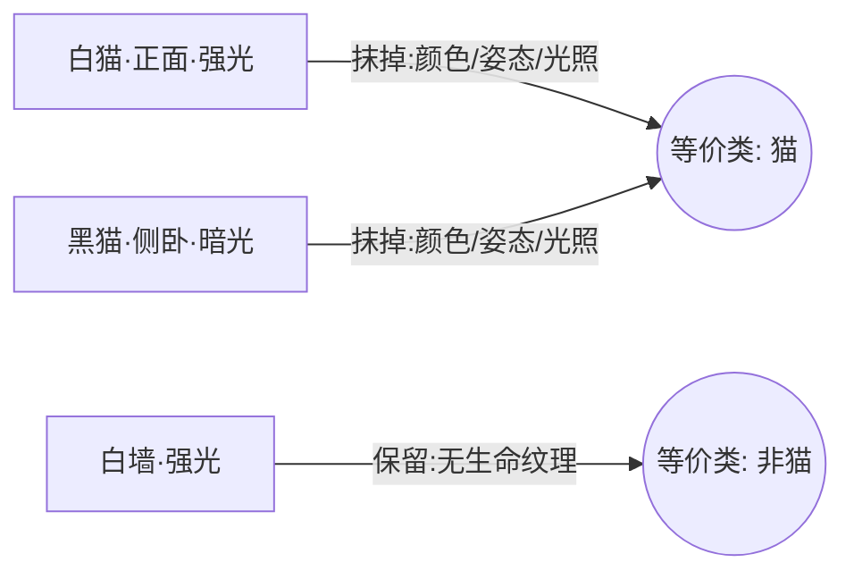

# Class as Learned Invariance

学习判断"同一类"的本质，是发现一个**等价关系**——即捕获"什么可以变、而答案不变"的那组不变性（invariance）。类的边界不是学习的输入，而是学习的产物。

## What It Is

一个反直觉的起点：**学习从来不是"先有类别，再把问题归进去"**。学习者一辈子只见过一个个孤立样本，"同一类"这条边界是它自己在过程中划出来的。真正的问题不是"如何归类"，而是"这条边界靠什么划出来"。

概念、范畴、抽象，全都是这个动作的产物：**一个概念 = 一个等价类 = 一组"随它怎么变都还算它"的不变性。** 学一个类，不是记住类里所有成员，而是学会**该忽略什么**。这直接承接 [[wiki/sources/The Bitter Lesson Source Guide|The Bitter Lesson]] 中"内置不变性"的思想——不变性不该手工写死，而应被学出来。

## How It Works

答案有三层，一层比一层深。

### 第一层：在表示空间里比距离

学习者不直接比原始输入（两张猫的图片像素几乎完全不同），而是先把输入**映射到一个表示空间**，再在那里比远近。

> "同一类" = 在学到的表示空间里离得近。

像素空间里白猫和白墙很近；好的表示空间里白猫和黑猫很近、猫和墙很远。**换空间，就换了"谁和谁算同类"。** 这与 [[wiki/concepts/Search and Learning as Meta-Methods]] 中"重构空间"一脉相承：定义对的空间，就等于定义对的"同类"。

### 第二层：归纳偏置决定哪些维度算数

"离得近"里藏着一个问题：近，是在**哪些维度**上近？一张图有无数属性（颜色、姿态、背景、光照……），凭什么"姿态变了还是同一只猫，物种变了就不是"？

做这个决定的是**归纳偏置（inductive bias）**——学习者预先带着的假设：哪些维度是本质、哪些是噪声。

- 没有偏置，就没有"同类"可言（No Free Lunch：不预设什么重要，就无法从有限样本推广到无限）。
- **偏置 = "同类"的定义本身。** CNN 内置的平移不变性，等于事先声明"物体平移了还是同一个东西"。

人个体的偏置，是**演化和文化预付的搜索**冻结下来的——几个例子就知道"这俩是一类"，不是天赋，是继承。

### 第三层：由评价信号回填

"哪个偏置对"最终由**评价信号**裁定：

> 两个问题算不算同一类，操作性定义是——同一个响应/策略能不能在两者上都拿到好评价。

同类不是长得像，而是"**能用同一招搞定**"。学习本质上在反向解一个方程：什么样的等价关系，能让"同类用同一招"持续得到奖励？

### 收口：抽掉可变量，留下不变量

抽掉被判定为"可变量"的属性，剩下的那个不变核，就是"类"。

## When to Use

这个视角在两处特别有用：

- **诊断过拟合**：因为"同类"是从数据 + 偏置里统计出来的，不是真理，它会把假的当成本质。模型把"雪地背景"学成"狼"的判据，就是划出了错误的等价关系"有雪 = 狼"。**过拟合的本质，是学到了一条错误的等价关系**——把偶然可变的东西当成了不变量。
- **理解数据多样性为何关键**：只有让"同一类里该变的都变过一遍"，学习者才会被逼着把它识别成可变量而抹掉，而不是误当本质留下。这与 [[wiki/topics/Learnable Structure in Data]] 中"可学习结构密度"相互印证。

一句话判据：**划对了叫抽象，划错了叫过拟合。**

## Boundary

"类 = 学到的不变性/等价关系"是一种解释框架，而非唯一形式化。它更贴合表示学习与深度网络，对符号规则系统、原型/样例理论等其它归类机制只是近似。归纳偏置与领域知识的分界同样存在争议。^[ambiguous]

## Related

- [[wiki/concepts/Search and Learning as Meta-Methods]]
- [[wiki/sources/The Bitter Lesson Source Guide]]
- [[wiki/topics/Learnable Structure in Data]]
- [[wiki/topics/Categorical Thinking]]
- [[wiki/topics/Methods of Classification]]
- [[wiki/maps/AI Map]]
- [[wiki/maps/Learning Map]]
