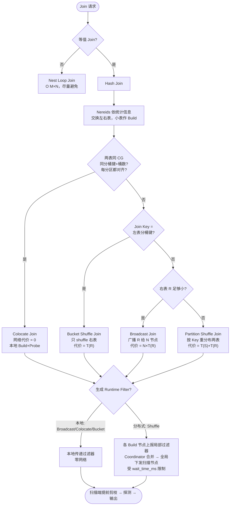

# Doris Join Shuffle Strategy

Doris（MPP 架构）执行 Join 时要回答两个独立的问题，它们叠加在一起构成完整的执行方案：

1. **用什么算法做 Join** —— Hash Join 还是 Nest Loop Join。
2. **数据怎么在节点间分布，才能让相同 Join Key 的行落到同一个节点** —— Broadcast / Partition Shuffle / Bucket Shuffle / Colocate。

第一层决定单机怎么匹配，第二层决定网络怎么搬数据。真正影响大查询性能的，通常是第二层。

---

## 第一层：Join 算法

### Hash Join

绝大多数等值 Join（`a.id = b.id`）走 Hash Join，分两个阶段：

- **Build（构建）**：取较小的一端（Build Side），对 Join Key 建一张内存哈希表。
- **Probe（探测）**：逐行扫描较大的一端（Probe Side），拿每行的 Join Key 去哈希表里查有没有匹配，命中就输出，没命中就丢弃。

```
dim_shop（Build）:         orders（Probe）逐行:
  shop_id=1 → {...}          shop_id=1 → 哈希表命中 → 输出 ✅
  shop_id=2 → {...}          shop_id=9 → 未命中     → 丢弃 ❌
  shop_id=5 → {...}          shop_id=2 → 命中       → 输出 ✅
```

「探测」= 拿大表每一行去哈希表里查匹配。问题在于探测开始前大表已经被全量扫上来了，`shop_id=9` 这类注定丢弃的行，磁盘 I/O 和传输已经白白发生——这正是 [[Runtime Filter]]（见下）的介入点。

### Nest Loop Join

当 Join 条件不是等值（`a.x > b.y`、`a.x BETWEEN b.lo AND b.hi`、笛卡尔积、`!=`）时，哈希表建不出来，只能退化成双重循环：外层每一行都去内层全表比一遍，复杂度 O(M×N)。Doris 只在无法用 Hash Join 时才选它，代价高，应尽量避免（比如把非等值条件改写出等值部分）。

---

## 第二层：数据分布策略

设 `R` 为右表（Doris 里默认作为 Build 端的小表），`S` 为左表（Probe 端的大表），`T(R)`/`T(S)` 表示各自的数据量，`N` 为参与计算的节点数。

| 策略 | 做法 | 网络代价 | 适用场景 |
|---|---|---|---|
| **Broadcast Join** | 把 R 完整广播给每个节点，各节点本地 Build+Probe | `N × T(R)` | R 很小（维度表） |
| **Partition (Shuffle) Join** | 按 Join Key 哈希，把 R 和 S 都重分布，相同 Key 落同一节点 | `T(S) + T(R)` | 两表都大，且分桶键不匹配 |
| **Bucket Shuffle Join** | 复用左表已有的分桶分布，只 shuffle 右表 R | `T(R)` | Join Key = 左表分桶键 |
| **Colocate Join** | 两表分桶规则相同且数据共置，无需 shuffle，直接本地 Join | `0` | 两表按同规则分桶且同 Colocation Group |

代价随策略递减：`N×T(R)` → `T(S)+T(R)` → `T(R)` → `0`。优化器（Nereids）会基于统计信息在这些方案里选代价最低的。

### Broadcast vs Shuffle 的权衡

Broadcast 代价 `N × T(R)`，节点越多、R 越大越亏；Shuffle 代价 `T(S) + T(R)`，与节点数无关但要搬动大表 S。所以：**R 足够小时 Broadcast 更优**（省掉搬 S），**R 变大或 N 变大时 Shuffle 更优**。这也是为什么 R 的大小估计错了（大表被误判成小表）会导致灾难性的 Broadcast。

---

## Bucket Shuffle 与 Colocate 展开

这两者都利用了「数据本来就按某种规则分好桶」这一事实来省网络。

### Bucket Shuffle Join

左表 S 建表时已经按某列分桶（`DISTRIBUTED BY HASH(col)`）。如果 Join Key 恰好就是这个分桶键，那么 S 的每个桶天然落在确定的节点上，**不需要动 S**，只要把右表 R 按同样的哈希规则 shuffle 过去即可。代价从 Shuffle 的 `T(S)+T(R)` 降到只有 `T(R)`——因为大表 S 一动不动。

限制：只对**左表**的分桶键生效（右表 R 仍要重分布），且要求 Join Key 与左表分桶键一致。

### Colocate Join

更进一步：如果 R 和 S 建表时用了**相同的分桶键、相同的桶数**，并且被显式放进同一个 **Colocation Group（CG）**，Doris 保证「相同桶号的数据物理上落在同一个 BE 节点」。此时相同 Join Key 的两表数据本来就在一起，Build 和 Probe 全在本地完成，**网络代价为 0**。

```
Colocation Group G:
  节点A: R桶0 + S桶0  → 本地 Join
  节点B: R桶1 + S桶1  → 本地 Join
  节点C: R桶2 + S桶2  → 本地 Join
```

Colocate 是四种策略里最快的，但约束也最强（见下）。

---

## Colocation Group 的对齐条件

两张表要能 Colocate，必须满足**分桶完全一致**，而分桶一致又依赖分区结构。核心约束：

- **分桶键类型和数量相同**：`DISTRIBUTED BY HASH(k1, k2)` 的键列表要逐一对应。
- **桶数（bucket num）相同**：桶数不同则同一个 Key 的哈希结果落到不同桶号，物理位置对不上。
- **副本数相同**：CG 内所有表副本策略一致，调度器才能把同号桶的所有副本放到同一组节点。

### 「同 Group」与多分区

- **同 Group**：显式声明 `"colocate_with" = "G"`，让多张表加入同一个 Colocation Group。同组的表共享一份「桶 → 节点」的映射（BucketSeq → BE），这份映射由 Colocate 调度器统一维护。
- **多分区**：一张表通常按时间等维度分成多个分区（Partition），**每个分区各自再分桶**。多分区表要 Colocate，要求**每个分区的分桶方式都一致**——因为映射是按桶号建立的，只要有一个分区的桶数或桶键不同，整表就无法保证同号桶共置。

### 为什么不同分区分桶会不一样

分区是可以「后加」的：新分区可能在建表演进后用了不同的 `buckets` 数（比如老分区 10 桶、按数据量增长新分区改成 32 桶）。Doris 允许动态分区各自指定桶数，所以**同一张表的不同分区，分桶数可以不同**。一旦不同，桶号到节点的映射在分区间就不统一，Colocate 的前提（同号桶同节点）被打破。因此要走 Colocate，必须保证参与的所有分区分桶方式完全一致。

### CG 是否必须单分区

不必须。CG 支持多分区表，只是要求 CG 内所有表的**每个分区**都保持相同的分桶键与桶数。换句话说，多分区没问题，前提是分区间分桶严格对齐；一旦某个分区分桶漂移，该表就退出 Colocate 快路径，回落到 Bucket Shuffle 或 Shuffle。

---

## CG 的开销与不推荐场景

Colocate 快是有代价的，它把「数据放置」变成了一个**全局硬约束**：

- **调度刚性**：同号桶的所有副本必须锁在同一组节点上。扩容、缩容、副本迁移时，Colocate 调度器要整体搬迁一个 group 的桶，比普通表调度更重、更慢。
- **数据倾斜放大**：如果分桶键分布不均，热点桶会一直压在固定节点上，无法通过重分布缓解。
- **建表耦合**：所有想 Colocate 的表被绑成一套分桶契约，任何一张表想改桶数/桶键都要考虑整个 group，牺牲了灵活性。
- **不稳定期回退**：节点故障、副本补齐期间，group 可能进入 unstable 状态，此时 Colocate 自动降级为普通 Join，性能突然掉档。

**不推荐**：表数量多且演进频繁、分桶键会变、数据严重倾斜、或只是偶尔 Join 的场景。Colocate 适合**固定的、长期稳定的、反复以相同键 Join 的大表对**（如事实表与常驻大维度表的固定关联）。

---

## Runtime Filter

Hash Join 探测阶段开始前，大表已被全量扫上来，注定不匹配的行也白白付出了 I/O。Runtime Filter 的思路：**Build 阶段完成后，把哈希表里存在的 Key 集合提炼成一个轻量过滤器，在扫描大表之前就下推过去，让扫描端提前跳过不可能匹配的行。**

```
不用 RF：扫 100 万行 → 探测 → 输出 10 万行
用 RF ：扫描时过滤 → 只有约 10 万行进入探测 → 输出 10 万行
```

### 过滤器类型（`runtime_filter_type`，可按位组合）

| 类型 | 枚举值 | 特点 |
|---|---|---|
| In | 1 | 直接下推 Key 的 in-list，Key 少时精确高效 |
| Bloom Filter | 2 | 几十~几百 KB 表示数百万 Key，有 false positive（<1%）但无 false negative |
| Min-Max | 4 | 只传最小/最大值，适合范围裁剪 |
| IN_OR_BLOOM | 8 | Key 少走 In，超阈值自动转 Bloom |

默认 `runtime_filter_type = 12`（Min-Max 4 + IN_OR_BLOOM 8）。传 Bloom 而不是整张哈希表，是因为哈希表可能几百 MB，Bloom 只需几十 KB，且误判只会「漏放行进探测」，不影响结果正确性。

### 传递方式（由 Join 分布模式决定）

- **Broadcast Join → 本地传递**：小表广播到每个节点，Build 端和 Probe 端在同一节点，过滤器不出节点，零网络。
- **Shuffle Join → 分布式传递**：Build 端（shuffle 后）和 Probe 端（原始扫描节点）不在一起，各 Build 节点把局部过滤器上报 Coordinator，合并成全局过滤器再下发给所有扫描节点。
- **Colocate / Bucket Shuffle → 本地传递**：数据天然共置，等同本地。

```
Build 节点1 → 局部 Bloom ↘
Build 节点2 → 局部 Bloom  → Coordinator 合并 → 全局 Bloom → 下推给扫描节点
Build 节点3 → 局部 Bloom ↗
```

### 等待窗口与陷阱

分布式 RF 有一个等待窗口——扫描节点要等过滤器到位才能充分剪枝。Doris 用 `runtime_filter_wait_time_ms`（默认 1000ms）控制：超时后扫描节点直接开扫，不再等。所以如果小表 Build 很慢（被误判为小表、或 Build 节点负载高），RF 可能完全没生效。在 Profile 里看 **`WaitForRuntimeFilter`** 耗时就能发现这个问题。

相关参数：`runtime_filter_mode`（OFF/LOCAL/GLOBAL）、`enable_runtime_filter_prune`。

---

## Runtime Filter vs 谓词下推

两者常被混淆，但作用点完全不同：

| 维度 | 谓词下推（Predicate Pushdown） | Runtime Filter |
|---|---|---|
| 时机 | 规划期（静态，编译期确定） | 执行期（动态，运行时才知道） |
| 条件来源 | SQL 里显式写的过滤条件 | 来自另一张表的实际数据 |
| 典型场景 | `WHERE status = 'paid'` | 大表 JOIN 小维度表 |
| 过滤器形态 | 原始谓词表达式 | Bloom / Min-Max / In-list |
| 作用 | 减少扫描的数据量 | 减少 Join 探测前的行数 |

一句话：**谓词下推是「把你已经知道的条件提前做」，Runtime Filter 是「把 Join 对象的实际数据范围反向告知扫描端，提前剪枝」。** 二者可叠加，一个查询里常同时生效：

```sql
SELECT * FROM orders o
JOIN dim_shop s ON o.shop_id = s.shop_id
WHERE o.created_date >= '2026-08-01'
```

- `created_date >= '2026-08-01'` → 谓词下推，直接裁剪分区/扫描范围。
- `shop_id` 匹配范围 → Runtime Filter，先扫 `dim_shop` 建 Bloom，再下推给 `orders` 扫描节点，提前排除不在维度表里的 `shop_id`。

---

## 优化器行为：左右表与 Join 交换

Doris 默认把**右表当 Build 端（小表）、左表当 Probe 端（大表）**。当用户写成「左小右大」时，Nereids 优化器会基于统计信息做 **Join Commute（交换左右表顺序）**，把估计更小的一端放到 Build 端，从而选到更省的 Broadcast 或让 Bucket Shuffle 复用大表分桶。所以「左表是小表、右表是大表」通常会被优化器自动纠正——前提是**统计信息准确**。如果统计缺失或过期，误判表大小会直接导致错误的 Broadcast 或错误的 Build 端选择，这也是 Doris 性能问题排查里最常见的根因之一。

---

## 决策图：Doris Join 选型与执行流程



## Related
- [[wiki/sources/Doris 写入与 Routine Load Source Guide|Doris 写入与 Routine Load Source Guide]]
