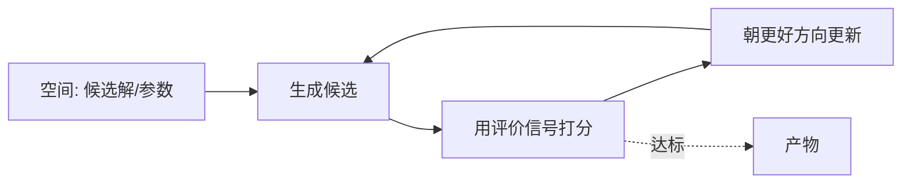
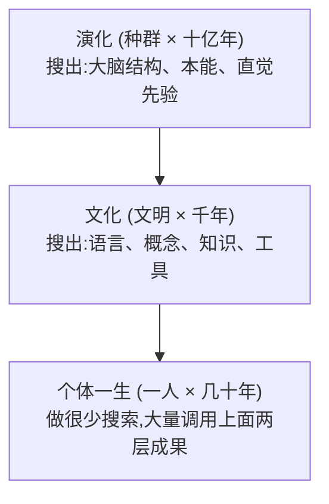

# Search and Learning as Meta-Methods

搜索与学习是"元能力"：它们本身不包含任何领域答案，只包含"如何找到答案"的过程，因此能把不断变便宜的算力自动兑换成能力增长。

## What It Is

关键在于区分两个层次——**对象层（知识本身）** 与 **元层（产生知识的方法）**。[[wiki/sources/The Bitter Lesson Source Guide|The Bitter Lesson]] 所说的 meta-method 指后者。

| | 对象层 | 元层 |
|---|---|---|
| 是什么 | 具体的答案、内容、洞见 | 产生答案的过程 |
| 例子 | 开局定式、音素规则、SIFT 特征 | 深度搜索、自我对弈、梯度下降 |
| 谁给的 | 人把已发现之物装进系统 | 系统自己去发现 |

搜索和学习被称为"元"，是因为你给搜索算法一个棋局它能下棋、给它语音它能识别——它对"棋"和"语音"一无所知，只知道怎么去搜、怎么去学。这是"关于能力的能力"。

## How It Works

### 判据：能否随算力任意扩展

这是 Bitter Lesson 的核心判据。

- **人类知识是静态内容**：注入一批领域洞见，短期变强，但会触顶（plateau）；算力翻十倍，手工特征也不会自动变好。
- **搜索与学习是过程**：多给一倍算力，就自动多搜一层、多学一轮，性能持续上涨，且不需要人再往里塞东西。

所以"元"有一层很实际的含义：**它是唯一能把摩尔定律带来的廉价算力自动兑换成能力增长的方法。**

### 本质：同一台"生成→评估→改进"的发现引擎

搜索和学习不是两种东西，而是同一个机制在不同空间、不同时间尺度上的两次投影。任何搜索或学习都由三个不变量构成：

1. **一个空间**——大到无法手工枚举的可能性空间；
2. **一个评价信号**——用来判断"好不好"的目标 / 反馈；
3. **一个迭代过程**——用算力把探针从差的区域推向好的区域。

差别只在"在哪个空间、什么时间尺度上搜"：

| | 搜索 | 学习 |
|---|---|---|
| 空间 | 单题的解 / 动作空间 | 函数 / 参数 / 表示空间 |
| 时间尺度 | 当下（inference time） | 跨经验（over experience） |
| 产物 | 一个答案（用完即弃） | 一个可复用映射（让未来搜索更便宜） |

**学习本身就是一种搜索**：梯度下降是在参数地形上的定向搜索；自我对弈用搜索产生经验、再把经验压进价值函数。AlphaGo 就是闭环——**搜索生成经验 → 学习把经验压成直觉 → 直觉再引导搜索**。

### 最底层：达尔文式的"生成并筛选"

面对无限复杂的世界，人永远枚举不完。唯一可扩展的办法是不预先规定答案，而是大量生成候选 + 用反馈筛选出好的。这就是变异 + 选择：**搜索是空间上的变异与选择，学习是时间上的变异与选择。** 因此最底层的本质是——搜索和学习是"发现"的通用引擎。^[inferred]

## Human Search and Learning

人类身上这三个不变量同样成立，但有一个关键反转：**人几乎不靠"当场大规模搜索"取胜，而是靠继承别处已经搜好的结果。算力是"预付"的，不是"现付"的。**

- 人的搜索：解题时试错、脑内模拟（对应波利亚解题、手段-目的分析）。
- 人的学习：把慢推理压成快直觉（专家 chunking = 把搜索结果沉淀成模式识别）。
- 同一个闭环：System 2（费力搜索）产生经验 → 固化为 System 1（快直觉）→ 直觉再引导下一次搜索，结构与 AlphaGo 一致。

表面上人"省搜索、靠先验"，正是 Bitter Lesson 批评的路线。矛盾的化解在于：人个体之所以几个例子就学会，是因为**免费继承了两场更大规模搜索的压缩结果**。

所以 Bitter Lesson 并未被违反——那场大规模搜索发生在演化和文化里，而不是发生在你这一生。^[inferred]

人真正领先、机器仍欠缺的一点是**重构空间本身**：机器多在我们划定的空间里搜，人却能改写问题、发明新表示、跳到原本不存在的空间去搜（这就是创造）。这也是文中"要造能像我们一样去发现的 agent"的真意。^[inferred]

## When to Use

判断"该走对象层还是元层"时问自己：

1. 我要解决的是一道题，还是一类题？（前者偏搜索，后者偏学习）
2. 我打算注入的东西是**答案**还是**发现答案的过程**？注入答案会触顶，注入过程能随算力扩展。
3. 手上真正稀缺的是算力、评价信号，还是可搜索空间的定义？
4. 这个改进"再给十倍算力"会自动变好吗？不会，就说明押在了对象层。

工程含义：与其把领域结论硬编码进系统，不如投资于**可扩展的搜索/学习循环 + 干净的评价信号**；把"发现"这件事交给算力去做。^[inferred]

## Boundary

"只内置元方法"在工程上并非绝对：卷积、注意力等仍是被内置的结构先验，其与"领域知识"的分界并不清晰。人/机的"同一台引擎"是一种解释性类比，"演化与文化是搜索"在严格意义上依赖对搜索三要素的宽松定义。^[ambiguous]

## Related

- [[wiki/concepts/Class as Learned Invariance]]
- [[wiki/sources/The Bitter Lesson Source Guide]]
- [[wiki/topics/Learnable Structure in Data]]
- [[wiki/concepts/Mechanism Model]]
- [[wiki/concepts/Nature of a Question]]
- [[wiki/maps/AI Map]]
- [[wiki/maps/Learning Map]]
