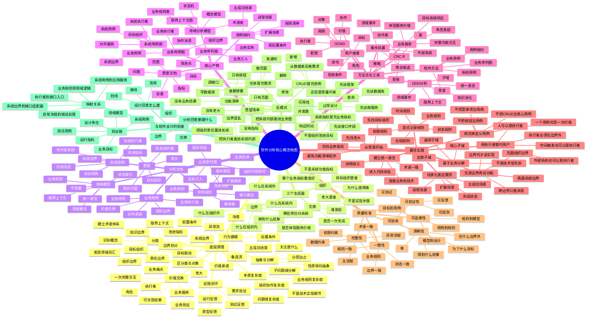

# Software Analysis Map

这页把软件分析中的核心概念按层次放在一张图里。它基于 `[[wiki/concepts/Software Analysis Three Generators]]` 的三根：`组织、交换、边界`。

这里的 `组织` 指目标组织、老大和业务改进指标，不是软件结构层级；`交换` 指执行者与目标系统之间一次完整的价值交互；`边界` 指组织、系统、责任和知识的边界。

## Concept Map

## Notes

这张图经 NotebookLM 中的《软件方法》、OOAD、DDD 资料校准后，保留了 `愿景 -> 业务用例 -> 业务序列图 -> 系统用例 -> 用例规约 -> 领域模型` 的主线。

需要特别防止两类混淆：

- `组织` 不是软件结构层级，而是目标组织、决策者和业务改进指标。
- 系统响应时间、并发数、可用性等是质量约束，不是组织改进指标。

CRUD 可以出现在实现和管理后台里，但不应在分析阶段冒充核心用例；核心用例应该体现执行者与系统之间一次完整的价值交换。

## Related

- [[wiki/concepts/Software Analysis Three Generators]]
- [[wiki/syntheses/Requirements Expression Beyond Use Cases]]
- [[wiki/sources/Use Case 开发管理 Source Guide]]
- [[wiki/sources/Use Case 协作与追踪矩阵 Source Guide]]
- [[wiki/syntheses/Use Cases as AI Coding Traceability Anchors]]
- [[wiki/maps/Software Design Map]]
- [[wiki/concepts/Software Design Three Generators]]
- [[wiki/concepts/Domain-Driven Design]]
- [[wiki/concepts/Business Modeling in Software]]
- [[wiki/topics/Software Methodology]]
- [[wiki/topics/Requirement to Architecture Mapping]]
- [[wiki/topics/User Stories]]
- [[wiki/topics/面向对象分析与设计]]
- [[wiki/maps/CS Map]]
