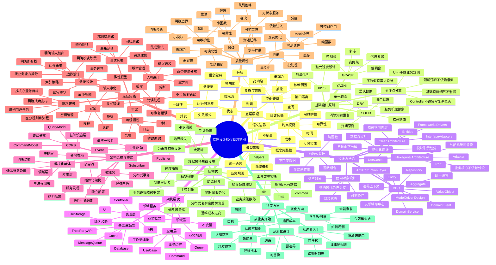

# Software Design Map

这页把软件设计中的核心概念按层次放在一张图里。关键区分是：

- `基础设计原则`：指导局部设计判断的原则，例如 SOLID、KISS、DRY。
- `设计方法论`：组织一整套设计活动的方法，例如 DDD、Clean Architecture、Hexagonal Architecture。
- `架构风格与模式`：系统级组织方式，例如分层架构、事件驱动、CQRS、微服务。

## Concept Map

## Notes

DDD 更适合归入 `设计方法论`，不是单个设计原则。它包含一组围绕领域、语言和边界展开的设计原则与建模实践。

这张图可以和 `[[wiki/concepts/Software Design Three Generators]]` 配合阅读：这里是展开地图，后者是把软件设计压缩成 `划线、接线、流转` 三个生成器。

## 架构师启示录补充

《架构师启示录》给这张软件设计地图补了一个从架构到实现的纵深：实现层不仅要讨论设计原则，还要检查分离性、复用性、防御性和一致性。

- 分离性：业务与技术、核心与非核心、变化与不变、不同非功能性需求、读写等操作类型、生产者/消费者等角色、权限/日志/事务/监控等切面、本质属性与偶然属性。
- 复用性：技术复用从函数、库、框架发展到体系；业务复用要处理“不变”和“创新变化”的张力。
- 防御性：身份认证、契约、最小知识、仲裁、重试、限流、熔断、超时和资源处理。
- 一致性：代码要与应用架构、数据架构、技术架构保持一致，并通过统一模型、统一概念和及时反馈降低信息失真。

这些内容连接到 [[wiki/concepts/架构一致性]] 和 [[wiki/concepts/重构层次]]：设计不是到图纸为止，而要在代码、运行和维护中持续校验。

## Related

- [[wiki/concepts/Software Design Three Generators]]
- [[wiki/concepts/Conceptual Integrity]]
- [[wiki/concepts/Domain-Driven Design]]
- [[wiki/topics/Modern Software Engineering]]
- [[wiki/topics/Software Methodology]]
- [[wiki/topics/面向对象分析与设计]]
- [[wiki/topics/UML Diagrams in Software Development]]
- [[wiki/maps/CS Map]]
- [[wiki/syntheses/软件设计作为系统诊断]]
- [[wiki/sources/设计模式 设计原则与系统思维 Source Guide]]

## Source layer

- [[wiki/sources/Use Case 开发管理 Source Guide]] — 说明 Use Case 如何作为行为契约衔接 UI、API、应用服务、领域模型、持久化、测试和任务拆分。
- [[wiki/sources/架构文档与图示之道 Source Guide]] — 保存一份关于架构文档、C4/UML 图示、ADR 与 Docs as Code 的中文课程材料。
- [[wiki/sources/设计模式 设计原则与系统思维 Source Guide]] — 保留一段把设计原则、设计模式、Iceberg Model、信息流和状态流转贯通起来的中文教学对话。
