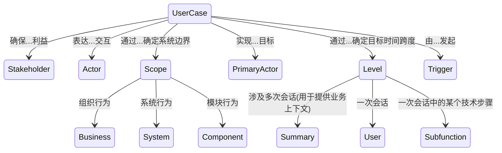

# Use Case Concept Graph

This diagram supports [[wiki/concepts/Use Case]] by showing its adjacent modeling concepts.

```mermaid
stateDiagram-v2
	UserCase --> Stakeholder: 确保...利益
	UserCase --> Actor: 表达...交互
	UserCase --> Scope: 通过...确定系统边界
	UserCase --> PrimaryActor: 实现...目标
	UserCase --> Level: 通过...确定目标时间跨度
	
	UserCase --> Trigger: 由...发起
	
	Scope --> Business: 组织行为
	Scope --> System: 系统行为
	Scope --> Component: 模块行为
	
	Level --> Summary: 涉及多次会话(用于提供业务上下文)
	Level --> User: 一次会话
	Level --> Subfunction: 一次会话中的某个技术步骤
```