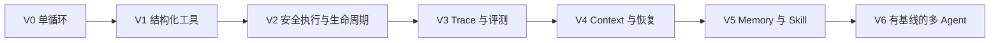

# AI Agent Engineering Learning Path

AI Agent 领域最值得建立的核心能力，不是熟悉最多框架，而是能设计、实现、验证和持续改进一个可靠的 Agent 系统。

学习目标应当从“会调用大模型和工具”提升为：

> 能把一个真实任务形式化为受约束的控制循环，让 Agent 在环境中持续观察、行动和修正；能够用轨迹、测试和指标解释它为什么成功或失败，并把重复失败转化为 harness 的长期改进。

这条路线将目标角色称为**可靠 Agent 系统工程师**。它以单 Agent 闭环为起点，以 harness、验证和评测为主线，最后才进入长期记忆、Skill 和多 Agent。

## 一、精通标准

精通 AI Agent 至少包含三类能力。

### 1. 建模能力

能够把 Agent 看成一个动态系统，而不是一段 Prompt：

$$
Agent = Model + State + Context + Tools + Environment + Feedback + Verifiers + Permissions
$$

进一步可以写成 [[wiki/concepts/Agentic Control Loop]] 的形式：

$$
A = \langle S, O, M, T, \pi \rangle
$$

- $S$：环境状态；
- $O$：Agent 能获得的局部观察；
- $M$：内部状态与记忆；
- $T$：动作和工具空间；
- $\pi$：根据当前观察与状态选择下一步动作的策略。

模型只负责其中一部分策略生成。系统是否可靠，还取决于观察是否充分、工具是否清晰、状态是否一致、反馈是否可用、权限是否受控，以及停止条件是否正确。

### 2. 构建能力

能够独立实现：

- 有明确目标与停止条件的 Agent loop；
- schema 化、可校验、职责单一的工具；
- 沙箱、权限、超时、预算和取消机制；
- context 构建、压缩与恢复；
- checkpoint、重试和故障恢复；
- trace、成本、延迟和状态迁移记录；
- 自动验证器、任务集和回归评测；
- 必要时的记忆、Skill 与多 Agent 协作。

### 3. 诊断与改进能力

面对一次失败，不笼统归因于“模型不够强”，而是能判断问题发生在：

```text
任务规格
→ 观察
→ 上下文
→ 状态或记忆
→ 计划
→ 工具选择
→ 工具执行
→ 反馈解释
→ 验证
→ 停止条件
```

更重要的是，能把失败转化为可持久化的改进：

- 新的测试或评测任务；
- 更清楚的工具 schema；
- 更好的 context 选择规则；
- 新的权限或验证门禁；
- 修订后的 Skill、模板或说明；
- 可监控的运行指标；
- 应当删除的无效脚手架。

## 二、学习的五条原则

### 原则一：先学系统，不先学框架

LangGraph、AutoGen、CrewAI 或其他框架只能减少局部实现成本，不能替代对控制循环、状态、反馈和验证的理解。

第一版 Agent 应尽量直接使用模型 SDK、普通函数和显式循环。只有亲手处理工具调用、状态更新、错误恢复和停止条件后，才能判断框架解决了什么、隐藏了什么，又引入了什么耦合。

### 原则二：先单 Agent，后多 Agent

多 Agent 会增加：

- 通信成本；
- 上下文同步；
- 状态一致性；
- 任务交接损耗；
- 调试路径；
- Token 与延迟；
- 权限和责任边界。

只有当任务可并行、上下文需要隔离、角色需要独立权限，或确实需要独立 reviewer/verifier 时，才应引入多个 Agent。

### 原则三：先验证，后记忆

没有验证器的记忆只会让系统更稳定地重复错误。

正确顺序是：

```text
可靠单轮执行
→ 可验证的多步执行
→ 可恢复的任务状态
→ 跨会话记忆
→ 可复用 Skill
→ 自我改进
```

### 原则四：以真实项目为学习单位

Agent 知识不能只靠阅读形成。每个概念都应落入一个可运行系统：

- 工具设计必须经过真实工具失败；
- context engineering 必须面对真实上下文预算；
- memory 必须证明能提高未来任务表现；
- orchestration 必须证明优于单 Agent；
- evaluation 必须能重复运行和比较版本。

### 原则五：用评测而不是演示判断进步

一次成功演示只能证明系统偶尔能工作。固定任务集、轨迹记录和版本对比才能说明能力是否稳定提升。

学习者每增加一种机制，都应回答：

1. 它解决了哪个已观察到的失败？
2. 哪项指标因此改善？
3. 它增加了多少成本、延迟和故障面？
4. 删除它之后会怎样？

## 三、先修能力

不需要先成为模型训练专家，但需要具备以下工程基础。

### 必须具备

- 熟练使用 Python 或 TypeScript；
- 理解 HTTP、JSON、API、schema 和鉴权；
- 能处理异步任务、超时、异常和重试；
- 熟悉文件系统、进程、Shell 和环境变量；
- 会写单元测试、集成测试和命令行程序；
- 理解日志、指标和基本可观测性；
- 能使用 Git 管理实验版本和回归改动。

### 边做边补

- Transformer、Token、上下文窗口和采样基础；
- embedding、关键词检索与 reranking；
- 状态机、队列、并发和分布式系统基础；
- sandbox、最小权限和凭证管理；
- 实验设计、置信区间和误差分析。

### 初期不必深挖

- 从头训练基础模型；
- 大规模强化学习基础设施；
- 复杂多 Agent 社会模拟；
- 为了展示而搭建通用 Agent 平台；
- 没有评测基线的自我进化。

## 四、主项目：Repo Task Agent

整条学习路线围绕一个持续演化的主项目：

> 构建一个 CLI Repo Task Agent。它接收一个仓库任务，检查仓库和相关文档，制定局部计划，修改文件，运行验证，根据反馈继续修复，最后输出可审查的结果与轨迹。

任务可以从低风险场景开始：

- 修复一个带测试的函数；
- 为明确行为补充测试；
- 修改配置并验证解析结果；
- 根据报错定位并修复小型 Bug；
- 完成一个有清楚验收条件的局部功能。

这个项目适合作为主线，因为代码、文件、命令、测试、diff 和错误日志都能成为可执行、可检查、有状态的 Agent 工作对象。它能同时训练工具、上下文、生命周期、验证和治理。

### 项目演化版本



### V0：最小闭环

- 接收目标；
- 读取少量文件；
- 调用一个模型；
- 选择并执行工具；
- 把结果送回模型；
- 达到条件后停止。

### V1：结构化行动

- 所有工具使用明确 schema；
- 参数在执行前校验；
- 结果统一转成模型可读 observation；
- 错误分为可重试、需修复、需用户介入；
- 工具保持职责单一。

### V2：安全执行与生命周期

- 最大步数、Token、成本和时间预算；
- 命令超时、取消和进程清理；
- 写操作审批或路径边界；
- checkpoint 与恢复；
- 幂等重试；
- 明确的成功、失败和暂停状态。

### V3：可观测与可评测

- 记录模型调用、工具调用、状态迁移和验证结果；
- 建立固定任务集；
- 对每次运行保存完整轨迹；
- 统计成功率、成本、延迟、工具错误和人工介入；
- 建立失败归因。

### V4：上下文与恢复

- 根据任务动态选择文件和说明；
- 分离当前 observation、工作状态和长期知识；
- 压缩冗长历史；
- 中断后从 checkpoint 重建上下文；
- 防止旧摘要与真实仓库状态漂移。

### V5：Memory 与 Skill

- 只写入经过验证、未来可能复用的经验；
- 为记忆保存来源、时间、适用范围和验证状态；
- 把重复工作流封装为 Skill；
- 用脚本承载确定性步骤，用模型处理判断与例外；
- 用回归任务证明 Skill 或记忆带来净收益。

### V6：多 Agent 对照实验

- 增加独立 reviewer 或 verifier；
- 必要时隔离检索、实现和验证上下文；
- 与单 Agent 基线比较；
- 只有质量收益大于通信、成本和延迟时才保留。

## 五、12 周学习路线

每周都必须产出可运行代码、评测证据和一份失败复盘。阅读只是为当前工程问题服务。

## 第 1 周：理解并实现 Agent Control Loop

### 学习内容

- [[wiki/concepts/Agent]] 与普通 LLM 调用的区别；
- observation、state、action、feedback 和 stop condition；
- ReAct 的基本循环；
- 结构化模型输出。

### 实践

- 不使用 Agent 框架，直接调用模型 SDK；
- 实现 `observe → decide → act → observe`；
- 提供 `read_file`、`search_text` 和 `finish` 三个动作；
- 保存每一步输入、动作与输出。

### 验收

- 能完成 5 个只读仓库问题；
- 不会无限循环；
- 每次停止都有明确原因；
- 能从轨迹解释 Agent 为什么选择某个动作。

## 第 2 周：工具与 Action Space

### 学习内容

- [[wiki/concepts/Agent Tool]]；
- JSON Schema 与参数校验；
- 工具描述如何影响模型选择；
- 工具数量与 action-space ambiguity；
- 错误如何转成下一轮可用 observation。

### 实践

- 增加 `write_file`、`apply_patch` 和 `run_test`；
- 为每个工具定义输入、输出、权限和错误类型；
- 对错误参数、文件不存在、命令失败设计稳定返回；
- 比较“一个万能工具”和“多个单一工具”的表现。

### 验收

- 非法参数不会进入执行层；
- 工具错误不会直接破坏整个会话；
- 轨迹中能区分模型选择错误与工具执行错误；
- Agent 可以完成至少 5 个小型写任务。

## 第 3 周：Execution 与安全边界

### 学习内容

- sandbox、工作目录和文件边界；
- 命令超时、子进程与资源限制；
- 最小权限；
- side effect、审批和回滚。

### 实践

- 将任务放入临时 Git worktree 或容器；
- 限制可写路径和可执行命令；
- 对高风险动作增加审批；
- 捕获 stdout、stderr、exit code 和超时；
- 失败后保留可检查现场。

### 验收

- Agent 无法写出授权目录；
- 超时任务能被终止且不遗留进程；
- 高风险操作不能静默执行；
- 每个外部副作用都能在 trace 中找到。

## 第 4 周：Lifecycle、状态与恢复

### 学习内容

- 状态机与显式任务阶段；
- retry、repair、pause、resume、cancel；
- checkpoint；
- 幂等和重复执行风险。

### 实践

- 定义 `Pending / Exploring / Editing / Verifying / Completed / Failed / Paused`；
- 每次状态迁移持久化；
- 模拟模型超时、工具失败和进程中断；
- 从 checkpoint 恢复，而不是从完整聊天记录重放。

### 验收

- 中断后能继续任务；
- 重试不会重复不可逆动作；
- 错误能落到明确状态；
- “任务状态”和“模型上下文”被分开管理。

## 第 5 周：Observability 与轨迹诊断

### 学习内容

- trace、span、event 和 correlation ID；
- Token、成本、延迟、重试与状态迁移；
- 最终结果指标与过程指标的区别；
- 从生产 trace 生成回归任务。

### 实践

- 为模型调用、工具调用、验证和状态迁移记录 span；
- 建立一次运行的 timeline；
- 为每种失败增加分类标签；
- 实现一个简单的运行报告。

### 验收

- 能回答一次运行花费在哪里；
- 能找到最慢、最贵和最易失败的步骤；
- 能从 trace 区分 context miss、tool error 和 verification weakness；
- 相同任务的两个版本可以比较。

## 第 6 周：Verification 与 Evaluation

### 学习内容

- [[wiki/concepts/Verification Loop]]；
- verification 与 validation 的区别；
- deterministic verifier、规则检查、测试和模型评审；
- [[wiki/concepts/Agent Evaluation Metric Vector]]；
- 任务成功率不能单独代表系统质量。

### 实践

- 建立 30～50 个固定任务；
- 为每个任务定义输入、允许动作和验收条件；
- 保存 Agent 版本、模型版本、运行参数和轨迹；
- 实现自动回归运行器。

### 验收

- 每个任务都能被明确判定成功或失败；
- 可以重复运行同一版本；
- 指标至少包含成功、成本、延迟、工具正确性、人工介入和安全违规；
- 新机制必须通过基线对比后才能保留。

## 第 7 周：Context Engineering

### 学习内容

- context 不是资料堆积，而是下一步决策的工作集；
- lexical、semantic、symbol 和 dependency retrieval；
- reranking、压缩、位置效应和 context drift；
- 静态规则、任务材料、运行 observation 和长期记忆的分层。

### 实践

- 实现关键词和符号检索；
- 为候选文件评分；
- 只把决策所需片段注入上下文；
- 比较整仓库塞入、检索片段和摘要三种策略；
- 记录被召回信息是否真正被使用。

### 验收

- 在不降低成功率的前提下降低上下文成本；
- 能识别“检索到了但模型没用”和“根本没检索到”；
- 长任务中摘要不会覆盖真实仓库状态；
- 重要证据不会长期埋在上下文中部。

## 第 8 周：持久状态、压缩与重建

### 学习内容

- session history、operational state 和 long-term memory 的区别；
- compaction、state offloading 和 context reconstruction；
- provenance 与 freshness；
- durable thread。

### 实践

- 将任务计划、已完成动作、未解决问题和验证状态写入结构化 checkpoint；
- 达到上下文阈值时重建会话；
- 比较“全量历史”“自然语言摘要”“结构化状态”；
- 注入旧状态和冲突状态测试恢复能力。

### 验收

- 长任务可跨多个模型会话继续；
- 恢复后不会重复已完成动作；
- 能检测 checkpoint 与仓库真实状态冲突；
- 状态压缩后仍保留决策关键证据。

## 第 9 周：Memory

### 学习内容

- write、manage、read 三阶段；
- 写入门禁、检索键、过期、冲突、删除和来源；
- episodic、semantic 与 procedural memory；
- memory utility，而非单纯 recall。

### 实践

- 只允许通过验证的经验进入长期记忆；
- 为每条记忆保存来源、时间、作用域和置信度；
- 加入冲突检测与过期策略；
- 准备“有记忆/无记忆”对照任务。

### 验收

- 记忆能提高未来任务成功率或降低成本；
- 错误记忆不会直接覆盖当前证据；
- 能删除、修订和追踪记忆来源；
- 能区分写入失败、管理失败和读取失败。

## 第 10 周：Agent Skill

### 学习内容

- [[wiki/concepts/Agent Skill]]；
- Skill 与 Tool 的边界；
- progressive disclosure；
- 确定性脚本与模型判断的分工；
- Skill 的触发、执行和评测。

### 实践

- 选一个重复出现的工作流封装成 Skill；
- 顶层文件只保留触发条件、流程和关键边界；
- 参考资料、脚本、模板按需加载；
- 把重复失败写成 gotcha、测试或脚本；
- 建立 Skill 路由与任务覆盖评测。

### 验收

- Skill 能在正确任务上被触发；
- 不相关任务不会误触发；
- Skill 能降低重建上下文的成本；
- Skill 的收益经过标准、进阶和边界任务验证。

## 第 11 周：Multi-Agent 与 Human-in-the-Loop

### 学习内容

- delegation 的真正目标：并行、隔离、独立判断与权限分离；
- handoff contract；
- shared state 与结果合并；
- 人类在价值、审批、否决和高风险判断中的位置。

### 实践

- 增加独立 reviewer 或 verifier Agent；
- 为委派任务定义输入、写权限、返回格式和完成标准；
- 不允许多个 Agent 无边界修改同一状态；
- 与 V5 单 Agent 进行 A/B 对比。

### 验收

- 多 Agent 在至少一个维度带来显著净收益；
- 委派失败不会破坏主任务状态；
- reviewer 保持相对独立，而不是复述执行者；
- 无收益的角色被删除。

## 第 12 周：系统实验与能力收口

### 学习内容

- ablation study；
- Pareto frontier；
- capability-control tradeoff；
- harness coupling 与机制淘汰；
- 从一次失败到 harness ratchet。

### 实践

- 分别移除 memory、reviewer、context reranker 或 reflection；
- 比较成功率、成本、延迟、稳定性和人工介入；
- 选择一个高频失败，完成从 trace 到回归测试再到 harness 修正的闭环；
- 编写系统设计与实验报告。

### 验收

- 能说明每个机制为什么存在；
- 能指出哪些机制应删除；
- 能展示至少一次有数据支持的 harness 改进；
- 能独立完成架构、实现、评测、诊断和复盘。

## 六、评测体系

学习项目必须从第 1 周开始积累任务，在第 6 周形成正式回归集。

### 任务集结构

建议准备 30～50 个任务，分成：

- 10 个只读探索任务；
- 10 个局部修改任务；
- 10 个带失败测试的修复任务；
- 5 个上下文干扰任务；
- 5 个工具或环境异常任务；
- 5 个权限、安全或不可逆动作任务；
- 若干需要暂停并向人提问的歧义任务。

每个任务包含：

```yaml
id: task-001
goal: 修复指定行为
initial_state: 仓库版本或 fixture
allowed_actions: [read, search, patch, test]
forbidden_actions: [network, write_outside_workspace]
success_criteria:
  - target_test_passes
  - regression_tests_pass
  - no_unrelated_diff
budget:
  max_steps: 20
  max_cost: 1.0
  timeout_seconds: 600
```

### 指标向量

参考 [[wiki/concepts/Agent Evaluation Metric Vector]]，至少记录：

| 维度 | 指标 |
|---|---|
| 结果 | task success、test pass、regression rate |
| 效率 | Token、费用、总时长、步骤数、工具调用数 |
| 工具 | 参数正确率、调用成功率、无效调用率 |
| 轨迹 | 重复循环、回退次数、计划偏离、状态冲突 |
| 稳健性 | 多次运行方差、异常恢复率、不同模型表现 |
| 安全 | 越权、策略违规、危险动作拦截率 |
| 人机协作 | 人工介入率、提问质量、审批次数 |

系统比较应当寻找 Pareto 改进，而不是只优化一个数字。提高成功率但让成本、延迟或违规率失控，不是可靠进步。

## 七、失败归因框架

每个失败都要落入具体层级。

| 层级 | 典型症状 | 优先检查 |
|---|---|---|
| 任务规格 | 做完了却不是用户要的 | 验收标准、术语、边界和歧义 |
| Observation | Agent 不知道环境已变化 | 工具返回、状态刷新、信息缺失 |
| Context | 关键文件没进入决策 | retrieval、ranking、压缩与位置 |
| State/Memory | 使用过期或冲突事实 | freshness、provenance、checkpoint |
| Planning | 步骤顺序错误或不可执行 | 依赖、权限、预算、任务粒度 |
| Tool Selection | 选错工具或反复试探 | schema、description、action space |
| Execution | 命令、API 或文件操作失败 | 参数、环境、超时、幂等 |
| Feedback | 错误已返回但未被理解 | 错误结构、噪声、反馈压缩 |
| Verification | 错误结果被宣布成功 | verifier、测试覆盖、完成条件 |
| Stop Condition | 无限循环或过早停止 | 预算、状态机、成功判定 |
| Governance | 发生越权或危险副作用 | 权限、审批、sandbox、审计 |

优先修复最接近根因的层，而不是用更长 Prompt 掩盖所有问题。

## 八、阅读路线

阅读应围绕当前工程阶段展开。

### 第一层：建立系统心智模型

1. [[wiki/concepts/Agent]]
2. [[wiki/concepts/Agentic Control Loop]]
3. [[wiki/topics/AI Harness]]
4. [[wiki/syntheses/Agent System Design Space]]

目标是理解 Agent 不是“模型 + Tool”，而是受到状态、环境、权限、反馈与恢复共同约束的系统。

### 第二层：建立工程闭环

1. [[wiki/concepts/Agent Tool]]
2. [[wiki/concepts/Verification Loop]]
3. [[wiki/concepts/Agent Evaluation Metric Vector]]
4. [[wiki/concepts/Coding Agent User Harness]]
5. [[wiki/concepts/Agentic Engineering]]

目标是让 Agent 的动作可执行、过程可观察、结果可验证、失败可归因。

### 第三层：扩展长期能力

1. [[wiki/topics/Context Management]]
2. [[wiki/topics/AI Memory]]
3. [[wiki/concepts/Agent Skill]]
4. [[wiki/syntheses/Agent Skill × Context Management]]
5. [[wiki/maps/Self-Evolving Agents Map]]

目标是理解上下文、记忆和 Skill 如何扩大能力，又如何引入污染、过期、负迁移和治理成本。

### 两篇总览材料

- [[wiki/sources/Agent Harness Engineering Survey Source Guide]]：用 ETCLOVG 检查生产 Agent 的七层工程能力；
- [[wiki/sources/Code as Agent Harness Paper Source Guide]]：理解代码如何成为可执行、可检视、有状态的 Agent 工作媒介。

## 九、ETCLOVG 能力地图

ETCLOVG 可以作为学习完成度检查表。

| 层 | 核心问题 | 学习产物 |
|---|---|---|
| Execution | 动作在哪里运行，如何限制副作用 | sandbox、超时、资源与路径边界 |
| Tooling | 能力如何描述、选择、执行和反馈 | schema 化工具与错误协议 |
| Context | 下一步真正需要看见什么 | retrieval、ranking、压缩与重建 |
| Lifecycle | 任务如何跨调用、失败和中断持续 | 状态机、checkpoint、retry、resume |
| Observability | 如何知道系统实际做了什么 | trace、成本、延迟和失败标签 |
| Verification | 如何判断任务与轨迹是否正确 | verifier、任务集、回归和归因 |
| Governance | Agent 可以做什么，责任由谁承担 | 权限、审批、身份、审计和人类门禁 |

这七层不是独立模块。工具错误会改变观察，上下文错误会改变计划，生命周期决定恢复，验证结果又必须通过 feedback 回到控制循环。

## 十、每周工作节奏

建议使用 `20% 阅读 + 60% 实现与实验 + 20% 复盘`。

### 阅读

- 只读当前阶段需要解决的问题；
- 每篇材料提取一个可验证的工程判断；
- 不按框架数量衡量学习量。

### 实现

- 每周只增加一个主要机制；
- 保留上一个版本作为基线；
- 先写最小实验，再扩大任务范围；
- 所有机制必须留下可检查 artifact。

### 复盘

每周回答：

1. 本周 Agent 最常见的失败是什么？
2. 失败发生在哪个系统层？
3. 哪个机制真的改善了指标？
4. 哪个机制只增加了复杂度？
5. 哪条经验应该进入测试、规则、Skill 或工具？
6. 下周最值得消除的不确定性是什么？

## 十一、常见误区

### 误区一：把框架 API 当成领域知识

框架会快速变化，控制循环、状态、反馈、权限和验证问题更稳定。应从不变量理解框架，而不是反过来。

### 误区二：一开始就做通用平台

没有真实任务和失败证据时，抽象通常只是想象。先让一个具体 Agent 经历足够多的真实失败，再提取公共结构。

### 误区三：用更长 Prompt 修复所有问题

Prompt 只能影响策略，不能替代缺失的工具、权限、状态、测试、数据和执行环境。

### 误区四：把长上下文等同于好上下文

信息存在不代表信息可用。无关内容、位置效应、旧摘要和冲突事实都可能降低下一步决策质量。

### 误区五：把 Memory 当成聊天记录仓库

未经筛选的历史会放大噪声和错误。Memory 必须具有写入门禁、来源、时间、作用域、冲突处理和删除能力。

### 误区六：默认多 Agent 更高级

多 Agent 是一种架构代价，不是成熟标志。没有隔离、并行或独立判断收益时，单 Agent 更容易保持状态一致和可调试。

### 误区七：只看最终答案

Agent 是轨迹系统。只看结果会掩盖盲目重试、越权、过高成本、偶然成功和无法恢复的问题。

### 误区八：只增加脚手架，不删除脚手架

模型能力和任务环境会变化。曾经有效的 planner、reflection、todo 或 reviewer 可能变成新的限制。成熟 harness 应当持续做消融与淘汰。

## 十二、方向分化

完成主线后，再根据兴趣选择分支。

### Agent 应用工程

重点：

- 领域工作流；
- 任务形式化；
- 人机协作；
- 产品体验；
- 业务验证器；
- 真实用户反馈。

适合希望把 Agent 用于客服、研究、数据分析、开发、办公或垂直行业的人。

### Agent 平台与基础设施

重点：

- sandbox；
- orchestration；
- durable execution；
- identity 与 permission；
- observability；
- evaluation platform；
- 多租户和成本治理。

适合偏后端、云基础设施、开发者工具和平台工程的人。

### Agent 研究

重点：

- planning 与 search；
- memory policy；
- tool learning；
- agentic reasoning；
- self-improvement；
- multi-agent coordination；
- benchmark 与 evaluator validity。

研究方向仍应保留系统基线，否则容易把 benchmark 局部收益误认为真实部署能力。

### Agentic Software Engineering

重点：

- repo understanding；
- code editing；
- testing 和 verification；
- coding-agent harness；
- Skill 与仓库知识；
- 人类注意力和责任分配。

这一路线与 [[wiki/concepts/Agentic Engineering]] 最直接相连：工程师的价值从逐行生成代码，转向设计规格、检查、反馈和可复用 harness。

## 十三、最终能力验收

完成路线后，应能独立回答并用系统证据证明：

### 架构

- Agent 为什么需要显式状态？
- context、operational state 和 memory 有什么区别？
- 工具应该如何划分？
- 什么时候应采用 workflow graph，什么时候保留开放循环？
- 什么时候多 Agent 真正优于单 Agent？

### 可靠性

- 如何限制不可逆副作用？
- 如何处理中断、超时和重试？
- 如何避免过早停止和无限循环？
- 如何让一次失败成为下一版的永久改进？

### 评测

- 如何定义一个真实任务的成功？
- 如何建立可重复任务集？
- 如何区分模型、上下文、工具、执行和验证失败？
- 如何比较质量、成本、延迟、安全与稳定性？

### 工程判断

- 哪些步骤应写成确定性程序？
- 哪些判断适合交给模型？
- 哪些动作必须交还人类？
- 哪些脚手架已经没有净收益，应当删除？
- 什么任务根本不应该使用 Agent？

真正的完成标准不是“做出了一个能演示的 Agent”，而是：

> 面对陌生 Agent 系统，能够还原它的控制循环、状态边界、工具面、反馈路径和验证机制；面对真实失败，能够定位根因、设计实验，并以可量化证据改进系统。

## 十四、第一周启动清单

如果立即开始，可以按以下顺序：

1. 选择 Python 或 TypeScript；
2. 创建一个只处理本地小仓库的 CLI；
3. 接入一个模型 API；
4. 实现 `read_file`、`search_text`、`finish`；
5. 写出显式循环、最大步数和停止原因；
6. 准备 5 个只读任务；
7. 保存每次完整轨迹；
8. 对每个失败按归因框架分类；
9. 周末写一页复盘；
10. 第二周再开放写工具。

先让系统闭环，再让系统可靠；先让失败可见，再让系统学习。

## Related

- [[wiki/concepts/Agent]]
- [[wiki/concepts/Agentic Control Loop]]
- [[wiki/topics/AI Harness]]
- [[wiki/syntheses/Agent System Design Space]]
- [[wiki/concepts/Agent Tool]]
- [[wiki/concepts/Verification Loop]]
- [[wiki/concepts/Agent Evaluation Metric Vector]]
- [[wiki/concepts/Agent Skill]]
- [[wiki/concepts/Coding Agent User Harness]]
- [[wiki/concepts/Agentic Engineering]]
- [[wiki/topics/TRAE Agent Capability Preparation Plan]]
- [[wiki/maps/Self-Evolving Agents Map]]
