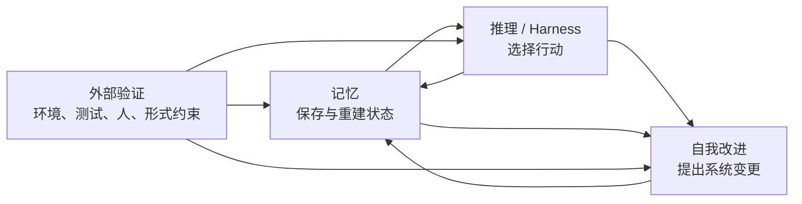

# AI Agent 三重悖论

AI Agent 的成熟并不只是把记忆、推理和自我改进三个模块分别做强。三者都在执行一种**元控制**：

- 记忆控制“哪些过去可以进入现在”；
- 推理与 harness 控制“下一步该做什么、何时停止”；
- 自我改进控制“未来的系统应该变成什么样”。

它们共同的问题是：控制者必须评价被控制对象，但评价所依赖的信息、工具和标准又来自同一个系统。这使单点优化容易变成闭环内的自我强化。 ^[inferred]

## 三组悖论

| 层 | 想获得的能力 | 为何反噬 | 更稳的设计问题 |
|---|---|---|---|
| 记忆 | 保留更多历史，让未来决策更准确 | 更多记录增加过期、冲突、噪声和时间混淆 | 此刻应读取哪段有效状态、什么粒度、什么证据 |
| 推理 / Harness | 用规划、工具、子 Agent 和评估补足裸模型 | 每层脚手架都增加故障面、协调成本和可攻击表面 | 哪个控制真正减少端到端风险，哪个只是移动风险 |
| 自我改进 | 从轨迹和反馈中持续提升未来表现 | 系统可能学会讨好指标、污染记忆或改坏 evaluator | 什么反馈独立、接地、不可被候选轻易改写 |

这些不是严格意义上的逻辑悖论，更接近三组**能力张力**：提高一个目标会增加另一个目标的治理负担。把它们叫作悖论有助于提醒设计者，但不应被理解为“任何改进都必然失败”。 ^[inferred]

## 1. 记忆悖论：完备性与可用性

[[wiki/topics/AI Memory]] 已经把记忆描述为 write–manage–read loop，而不是被动存储。这里进一步出现两种控制压力：

1. **相关性控制**：是否需要检索、检索多少、用哪种查询和抽象层次。
2. **时间控制**：哪些记录是当前状态，哪些只是历史、过渡或已被纠正。

“记住一切”会把存储正确性与决策正确性混为一谈。一个系统可以完整保存用户住址的所有历史，却因没有 [[wiki/concepts/Temporal Memory Validity]] 而无法回答“现在住哪里”。 ^[inferred]

因此，遗忘至少有三种含义：

- 物理删除，不再保留；
- 从当前状态中退出，但保留历史证据；
- 不进入本轮 active context，但仍可按需检索。

记忆优化的目标不应是 recall 最大化，而是**在有限上下文中重建与当前决策相符的状态**。 ^[inferred]

## 2. 推理悖论：能力补偿与系统复杂度

[[wiki/topics/AI Harness]] 通过规划、工具、权限、状态、验证、恢复和多 Agent 协调补足单次模型调用。但 harness 不是免费能力：

- planner 可能把错误边界写进整个计划；
- tool abstraction 可能隐藏关键状态；
- subagent communication 可能丢失意图或制造冲突；
- evaluator 可能把语义偏好伪装成事实；
- retry 和 recovery 可能掩盖真实失败并放大成本；
- 安全护栏本身可能成为模型寻找绕行路径的对象。

所以“增加脚手架”不能作为默认答案。应先证明新组件减少的风险大于它引入的故障面。 ^[inferred]

这与 [[wiki/concepts/Agent Evaluation Metric Vector]] 一致：如果只看任务成功率，就会漏掉 token、延迟、循环率、工具错误、安全违规和人工介入。端到端可靠性必须以向量而不是单一分数评价。 ^[inferred]

## 3. 进化悖论：优化器与评估器

自我改进系统必须回答两个不同问题：

1. **可改什么**：模型权重、harness 代码、skill、memory、prompt 或 evaluator。
2. **凭什么保留改动**：自评、模型裁判、人类判断、执行测试或形式验证。

[[wiki/concepts/Continual Learning for AI Agents]] 处理第一个问题，[[wiki/concepts/Verifier Hierarchy]] 处理第二个问题。

危险的闭环是：

```text
生成候选
  ↓
同一系统定义或解释评分
  ↓
候选按评分优化
  ↓
评分表面越来越好
  ↓
真实目标、边界情况和诚实性逐渐退化
```

更稳的闭环把 proposer、executor、verifier 和 governor 分开，并让持久改动通过 held-out、可回滚、尽可能外部接地的检查。 ^[inferred]

## 共同根：元能力依赖对象能力

三者之所以耦合，是因为每个元能力都借用另一个对象能力：



- 记忆需要推理来选择写入、检索、合并和遗忘。
- 推理需要记忆提供当前状态、历史约束和失败经验。
- 自我改进需要记忆保存轨迹，也需要推理提出候选。
- 记忆和推理策略本身又可能被自我改进改写。

如果没有外部验证，系统容易在这个闭环里循环证明自己。 ^[inferred]

## 破局不是更强元能力，而是更强接地

来源把 Harness as Environment 和独立诚实通道视为出路。更一般的工程原则是：

### 1. 让状态可反驳

记忆记录要有来源、时间有效性、置信度、纠正和 supersession 关系；不能只存一段自然语言。

### 2. 让行动产生外部证据

工具执行、环境状态、测试结果和用户反馈应进入 trace，而不是让模型只根据自己的叙述判断是否成功。

### 3. 让验证器保持部分独立

候选不能任意改写验收标准；高影响更新应使用 held-out checks、独立权限和回滚。

### 4. 让复杂度接受消融

每增加 planner、memory layer、subagent 或 judge，都应比较“有它”和“没有它”的端到端表现。没有可测增益的脚手架应删除，而不是因架构先进而保留。 ^[inferred]

### 5. 让更新范围匹配证据强度

一次含糊自评可以影响当前回答，但不应直接改写组织级 memory；一组任务上的通过可以更新局部 skill，但不自动证明应该重训通用模型。更新越持久、作用域越广，所需验证越强。 ^[inferred]

## 安全维度：能力增长不等于主体性增长

来源还引入一条人类侧风险：长期记忆和强推理可能让 Agent 更擅长预测、影响和替代用户判断。有关 Anthropic “disempowerment”研究的具体结论需要读原论文确认。 ^[ambiguous]

但可提炼出的设计问题成立：

- Agent 是在提供证据、选择和反例，还是直接替用户封闭问题空间？
- 长期个性化是在支持用户目标，还是通过持续迎合固化其偏见？
- 系统是否记录用户授权、拒绝和改主意，而不只记录偏好？
- 是否有一种长期指标衡量用户能力和决策权有没有被系统侵蚀？ ^[inferred]

这意味着安全不仅是“Agent 有没有做坏事”，还包括“Agent 是否逐步拿走了人的判断位置”。 ^[inferred]

## 实践检查表

面对一个声称有记忆、推理和自我进化能力的 Agent，可以依次问：

### 记忆

- 当前事实、历史事实、事件和过渡是否被区分？
- 检索策略是否随任务阶段变化？
- 记忆是否有删除、失效、纠正和冲突处理？
- memory regression 是否测下游任务，而不只测 recall？

### 推理与 Harness

- 新脚手架解决了哪种可观测失败？
- 它增加了哪些故障点、权限和协调成本？
- 单 Agent 与多 Agent 是否做过相同预算下的对照？
- 能否从 trace 定位失败发生在计划、工具、记忆、权限还是验证？

### 自我改进

- proposer、verifier 和 governor 是否共享同一激励与修改权限？
- evaluator 能否被候选间接游戏化？
- 是否有 held-out 任务、外部执行和回滚？
- 改进是局部有界优化，还是未经证明地扩展为开放式 RSI？

## 可信度说明

这页的结构来自一篇明确标注 AI 生成的二手综述。文章列出的 2026 年论文、产品机制、实验数据和安全研究尚未逐项读取原始来源，因此本页把可迁移的系统关系标成推论，并把具体数字与机制主张留在 [[wiki/sources/AI Agent 三重悖论 Source Guide]] 中。^[ambiguous]

它当前更适合作为**研究假设与工程诊断框架**，不适合作为相关论文结论的证据替代品。

## Related

- [[wiki/topics/AI Memory]]
- [[wiki/topics/AI Harness]]
- [[wiki/concepts/Temporal Memory Validity]]
- [[wiki/concepts/Verifier Hierarchy]]
- [[wiki/concepts/Continual Learning for AI Agents]]
- [[wiki/concepts/Verification Loop]]
- [[wiki/concepts/Agent Evaluation Metric Vector]]
- [[wiki/maps/Self-Evolving Agents Map]]
- [[wiki/sources/AI Agent 三重悖论 Source Guide]]
