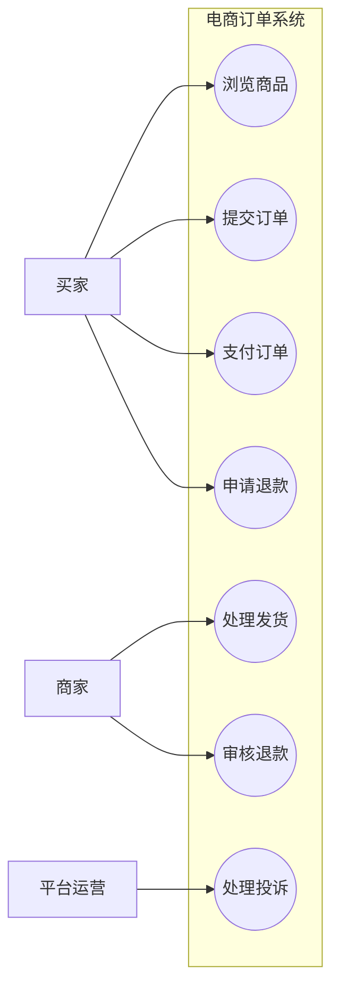
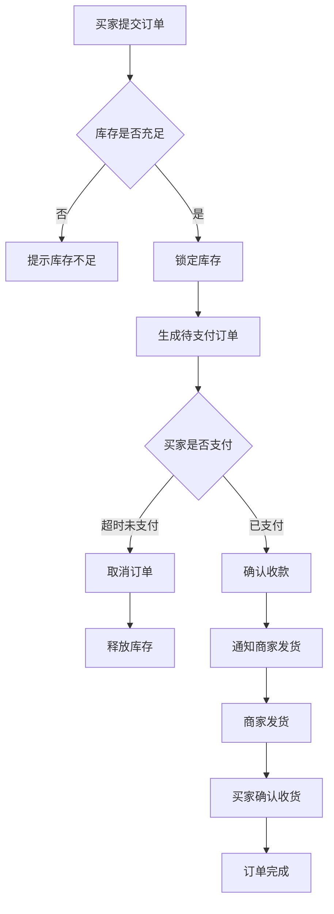
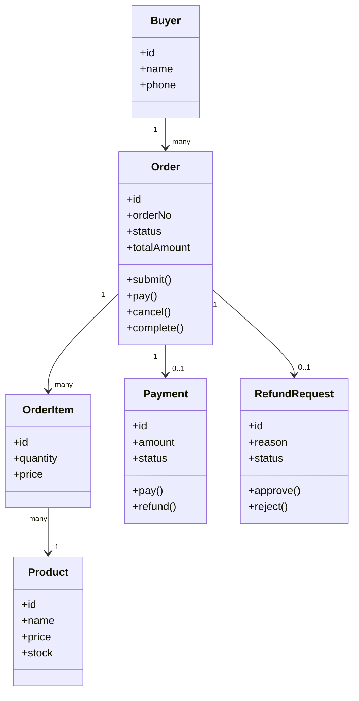
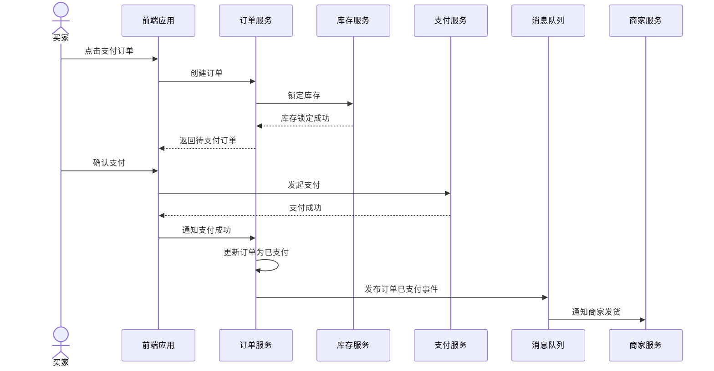
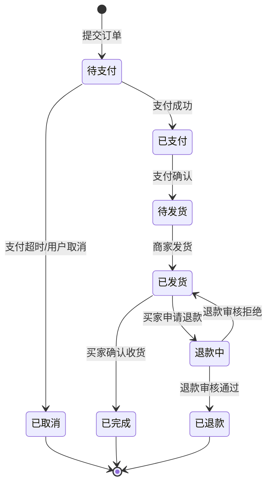
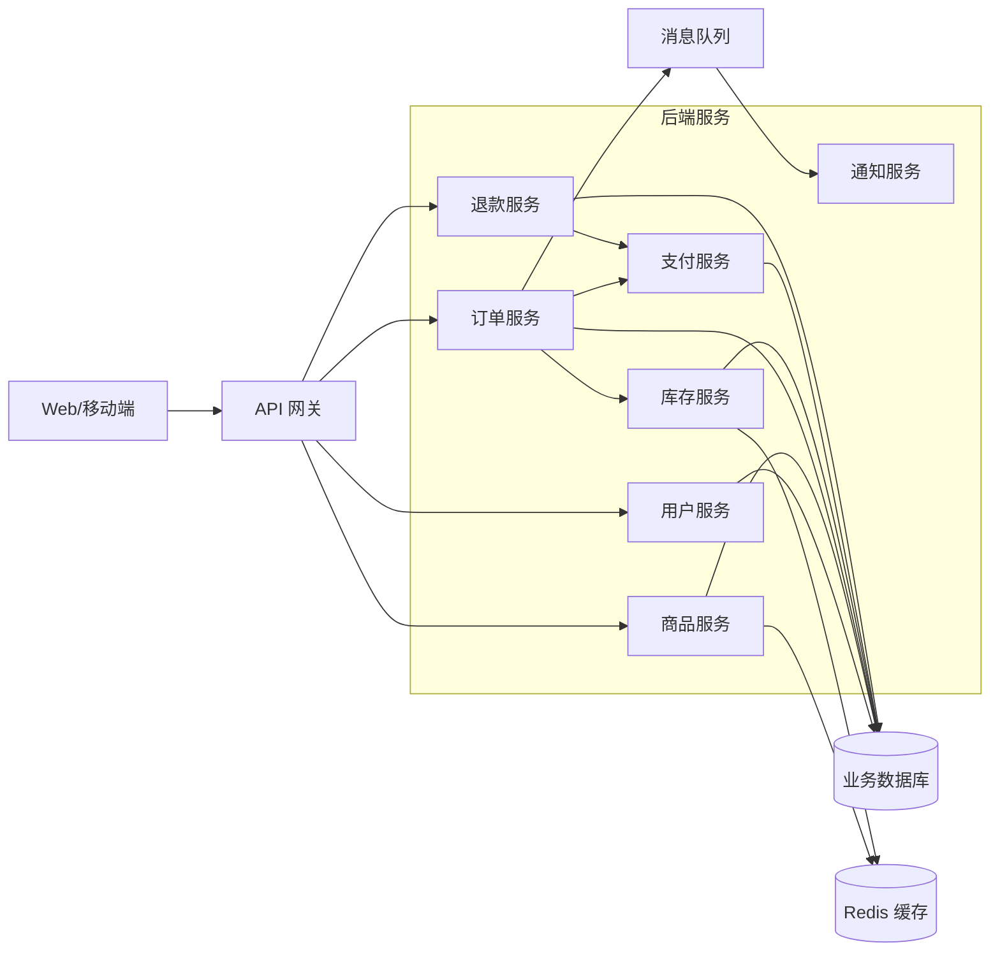
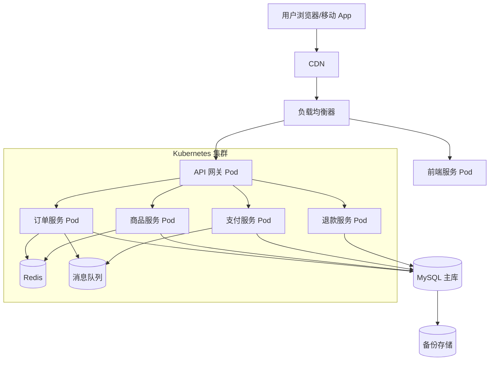

# UML Diagrams in Software Development

UML 图不是一套必须全画的仪式，而是一组在不同开发环节回答不同问题的建模工具。

最实用的压缩版是：

> 需求看用例图，流程看活动图，领域看类图，协作看序列图，状态看状态机图，架构看组件图，运行看部署图。

## 图与开发环节的映射

| 开发环节 | 核心问题 | 适合的 UML 图 |
|---|---|---|
| 业务理解 | 组织、用户到底想完成什么？ | 用例图、活动图 |
| 需求分析 | 系统边界是什么？外部角色是谁？系统承诺什么能力？ | 用例图 |
| 业务流程分析 | 一件事从开始到结束怎么流转？有哪些分支、并行、异常？ | 活动图 |
| 领域建模 | 业务里有哪些核心概念？它们之间是什么关系？ | 类图、对象图 |
| 系统交互设计 | 用户、系统、服务、对象之间如何协作完成一个场景？ | 序列图、通信图 |
| 状态生命周期设计 | 订单、工单、审批、设备等对象会经历哪些状态？ | 状态机图 |
| 模块与架构设计 | 系统拆成哪些模块、组件、服务？它们如何依赖？ | 组件图、包图 |
| 数据与对象设计 | 类、实体、值对象、聚合之间如何组织？ | 类图 |
| 接口设计 | 一次请求会经过哪些服务？谁调用谁？返回什么？ | 序列图 |
| 部署设计 | 服务部署在哪里？服务器、容器、数据库、网关如何连接？ | 部署图 |
| 测试设计 | 要覆盖哪些业务路径、状态变化、交互链路？ | 用例图、活动图、状态机图、序列图 |
| 运维与交付 | 运行环境、节点、网络、依赖关系是什么？ | 部署图、组件图 |

## 核心图解决的问题

### 用例图：系统对外承诺什么

用例图用于需求分析。它把系统看成一个黑盒，关注外部执行者和系统能力之间的关系。

它适合回答：

- 谁会使用这个系统？
- 系统边界在哪里？
- 系统对外提供哪些可被验收的能力？

### 活动图：流程如何推进

活动图用于业务流程分析。它关注动作、条件、分支、并行和结束条件。

它适合回答：

- 一个业务流程从哪里开始，到哪里结束？
- 正常路径、异常路径分别是什么？
- 哪些动作可以并行，哪些动作必须串行？

### 类图：领域里有什么

类图用于领域建模和对象设计。它描述类、属性、方法、继承、关联、聚合、组合等关系。

它适合回答：

- 业务中的核心概念是什么？
- 概念之间是一对一、一对多，还是包含关系？
- 哪些对象承担哪些责任？

### 序列图：一次场景如何协作

序列图用于交互设计、接口设计和集成设计。它按时间顺序描述用户、系统、服务、对象之间的消息传递。

它适合回答：

- 一次请求从入口到完成经过哪些对象或服务？
- 谁先调用谁？失败时谁补偿？
- 哪些交互是同步的，哪些交互可以异步？

### 状态机图：对象生命周期如何变化

状态机图用于描述关键对象的状态和状态转换规则。

它适合回答：

- 一个对象有哪些合法状态？
- 什么事件会触发状态变化？
- 哪些状态转换不应该被允许？

### 组件图：系统如何拆分

组件图用于架构设计。它关注模块、服务、库、子系统之间的依赖关系。

它适合回答：

- 系统由哪些组件组成？
- 哪些组件依赖哪些组件？
- 哪些边界需要稳定，哪些部分可以替换？

### 部署图：系统如何运行

部署图用于交付、运维和运行时架构表达。它关注软件组件部署到哪些节点、容器、服务器或设备上。

它适合回答：

- 服务运行在哪些节点上？
- 网关、数据库、缓存、消息队列如何连接？
- 故障、扩容、网络边界在哪里？

## Case：电商下单与退款系统

下面用一个电商系统贯穿不同图的用法。Mermaid 不完整支持 UML 的所有图，因此用例图、组件图、部署图使用 `flowchart` 近似表达。

### 需求阶段：用例图

### 业务流程分析：活动图

### 领域建模：类图

### 接口与协作设计：序列图

### 生命周期设计：状态机图

### 架构设计：组件图

### 部署运维阶段：部署图

## 从图反推测试

| UML 图 | 可导出的测试                      |
| ----- | --------------------------- |
| 用例图   | 验收测试：买家下单、支付、退款；商家发货；平台处理投诉 |
| 活动图   | 流程测试：库存不足、支付超时、正常支付、取消订单    |
| 类图    | 单元测试：订单金额计算、库存扣减、退款规则       |
| 序列图   | 集成测试：订单服务、库存服务、支付服务调用是否正确   |
| 状态机图  | 状态转换测试：待支付不能直接变已完成，已取消不能支付  |
| 组件图   | 契约测试：服务之间接口是否兼容             |
| 部署图   | 环境测试：网关、数据库、缓存、消息队列连接是否正常   |

## Related

- [[wiki/topics/Software Methodology]]
- [[wiki/topics/面向对象分析与设计]]
- [[wiki/topics/Requirement to Architecture Mapping]]
- [[wiki/topics/User Stories]]
- [[wiki/topics/Testing Strategy]]
- [[wiki/topics/Testing Purpose]]
- [[wiki/maps/CS Map]]
- [[wiki/index]]
